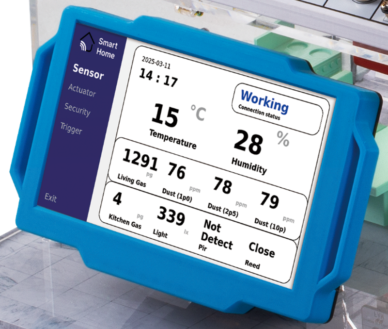
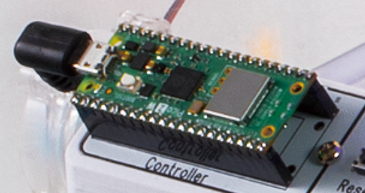
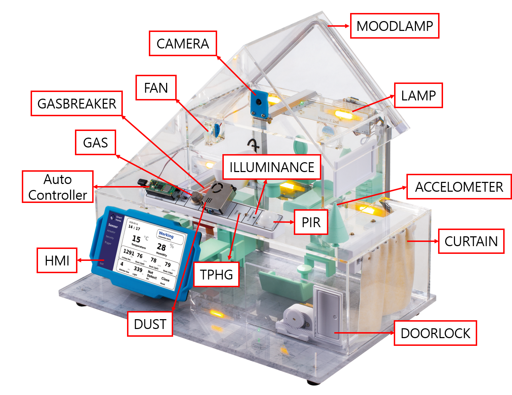
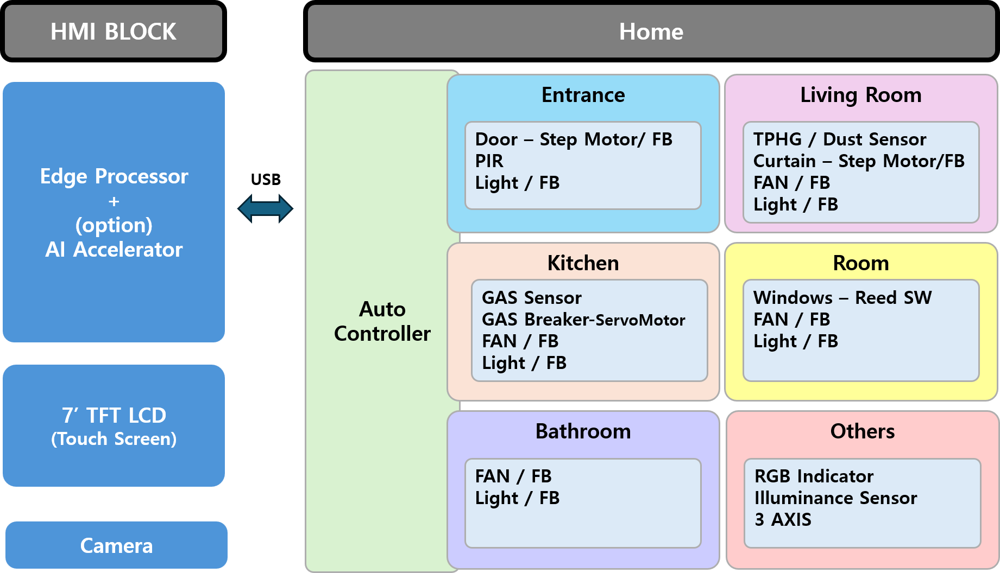
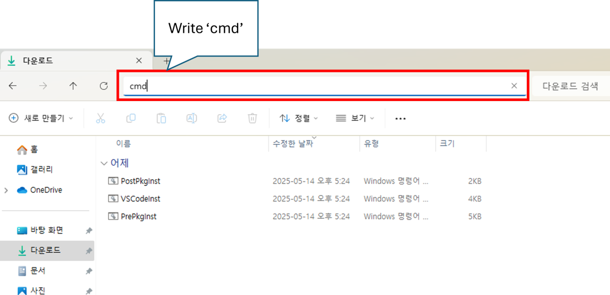

# XHome
IoT 센서가 부착된 장비는 온도, 습도, 압력, 진동 등 다양한 데이터를 실시간으로 수집하여 전송하며, 이렇게 수집된 데이터를 분석함으로써 생산 공정의 효율성을 극대화하고 불량률을 감소시키며 생산량을 최적화할 수 있습니다.   
또한, IoT 데이터 기반의 공정 자동화를 통해 특정 조건 충족 시 기계의 자동 작동 또는 정지 설정이 가능해져 인적 오류를 줄이고 생산 속도를 향상시킬 수 있으며, 장비 상태를 실시간으로 모니터링하여 고장을 사전에 예측하고 예방함으로써 장비 수명 연장 및 갑작스러운 고장으로 인한 생산 차질을 최소화합니다.

산업별 IoT 기술 적용 사례는 다음과 같습니다.

- 제조업: 스마트 팩토리 구축을 통해 생산 공정의 효율성을 극대화하고, 불량률을 최소화하며, 생산성 향상
- 에너지 산업: 스마트 그리드를 구축하여 에너지 효율을 높이고, 전력 공급의 안정성 향상 
- 물류 산업: 물류 추적 및 관리를 자동화하여 물류 효율성을 높이고, 배송 시간 단축
- 농업: 스마트 팜을 구축하여 작물의 생육 환경을 최적화하고, 생산량 증대

## 플랫폼 구성
XHome은 가정, 사무실, 공장 등에 설치된 인터넷 기반 자동 설비 제어에 필요한 소프트웨어 기술 학습을 위한 플랫폼입니다. HMI와 Auto 제어기, Auto 제어기용 주변장치 등으로 구성됩니다.  


플랫폼은 크게 HMI, Auto 제어기, 액츄에이터, 센서로 구분이 가능하며 각각의 기능은 다음과 같습니다. 

### HMI (Human Machine Interface)
HMI는 사용자와 기계간의 상호작용을 가능하게 해주는 인터페이스입니다. 자동화 산업에서 기계와 작업자 간의 통신을 원활하게하여 작업 효율을 높이는데 사용됩니다. 사물 인터넷(IoT) 환경에서 데이터를 수집하고 전송하며, 데이터를 시각화 하는 용도로도 활용됩니다. 
XHome의 HMI는 Linux 계열의 OS를 기반으로 다양한 프로그래밍 언어를 처리할 수 있으며, Wi-Fi나 Bluetooth를 통해 무선 통신기능을 포함하고 있습니다. 



XHome은 HMI는 다음과 같은 특징을 갖습니다.

- ARM Cortex-A76 기반의 고성능 CPU 탑재
- Wi-Fi 및 Bluetooth, BLE 기반의 무선 통신 기능 제공 
- 7-inch TFT-LCD 및 TouchScreen 탑재
- 머신러닝 기반 스마트홈 자동화 확장을 위해 AI 가속기 지원 

### Auto 제어기 
Auto 제어기는 PWM 컨트롤러, IO 포트등을 통해 산업 현장의 다양한 장치를 제어할 수 있습니다. PWM 컨트롤러로 조명의 밝기나 DC 모터의 속도를 정밀하게 조절할 수 있습니다. 또한, IO 포트를 통해 스위치, 가스 누설 감지 센서 등을 연결하여 다양한 상황을 감지하고 대응할 수 있습니다. 



### Actuator 
XHome의 Actuator는 Lamp, Fan, Doorlock, GasBreaker, Curtain, MoodLamp가 있으며 각각은 Auto제어기를 통해 제어됩니다. 또한 동작을 눈으로 확인하는것에 그치지않고, 피드백 신호를 통해 제어 신호가 정상적으로 동작했는지 확인도 가능합니다. 

**Lamp**  
XHome의 Lamp는 총 5개가 장착되어 있으며 단색 LED로 구성되며, 각각 현관, 거실, 주방, 침실, 화장실에 장착되어 있습니다. 

**Fan**  
XHome의 FAN은 총 4개가 장착되어 있으며 각각 거실, 주방, 침실, 화장실에 장착되어 있습니다. 실제 FAN의 동작을 통해 움직임 확인도 가능하며, 함께 장착된 LED를 통해 동작여부를 쉽게 확인할 수 있습니다. 

**Doorlock**  
DoorLock은 현관 문을 열거나, 닫는 용도로 입니다.  

**GasBreaker**  
GasBreaker는 주방에 위치하고 있으며 주방의 가스벨브를 제어하는 역활을 담당합니다.  

**Curtain** 
Curtain은 1층에 위치하고 있으며 좌우로 움직이는 형태로 실제 집의 거실이나 침실에 주로 장착되어 있는것을 원격으로 제어하는 역활을 담당합니다.  

**MoodLamp**  
MoodLamp는 Lamp와 다르게 RGB LED로 구성되어 있으며, 이를 통해 현재 XHome의 상태를 색상으로 표현이 가능합니다. 

### Sensor 

**PIR Sensor**  
PIR 센서(Passive Infrared Sensor)는 사람이나 동물의 움직임을 감지하는 데 사용되는 전자 센서입니다. 

**ILLUMINANCE Sensor**  
ILLUMINANCE 센서는 주변의 밝기를 측정하는 센서입니다. 측정 단위는 룩스(lx) 입니다. 

**TPHG Sensor**  
TPHG 센서는 4가지 기능을 포함하고 있습니다. 각각의 기능은 다음과 같습니다.   
- T : 온도(Temperature)  
- P : 기압(Pressure)  
- H : 습도(Humidity)  
- G : 가스(Gas)

**DUST Sensor**  
Dust 센서는 먼지감지 센서로 1.0μm, 2.5μm, 10μm 의 미세먼지를 측정합니다.  

**GAS Sensor**  
GAS 센서는 LPG, NG등을 측정가능한 아날로그 센서로 센서 내부의 저항 변화를 측정하여 공기중 가연성 가스 존재를 측정합니다. 

**Open Detection Sensor**  
Open Detection 센서는 XHome의 2층 창문에 설치되어 있으며 창문의 열림 닫힘 여부를 감지하는 용도입니다. 

**ACCELOMETER Sensor**  
Accelometer는 3축 가소고 측정이 가능한 센서로 XHome에서는 건물의 충격을 감지하는 용도로 활용됩니다. 

## XHome 구성도  

XHome의 전체 장치의 위치는 다음과 같습니다. 



## Hardware Block 


XHome의 하드웨어는 크게 2개 부분으로 구분할 수 있습니다. HMI Block 과 Home 입니다. HMI는 Edge Processor 와 함께 7" LCD가 장착되어 있어 GUI를 통한 제어 및 모니터링이 가능하며 카메라 또한 HMI 와 연결되어 있습니다. Home 블럭에는 세부적으로 6개 부분으로 구분 가능합니다. 현관(Entrance), 거실(Livingroom), 주방(Kitchen), 침실(Room), 화장실(Bathroom), 기타(Othres)이며 각 위치에 센서 및 액츄에이터가 존재합니다. 이러한 장치들은 Auto Controller에 장착되어 있어 실질적인 제어는 Auto Controller가 담당하며 Edge Processor에서는 Auto Controller에서 수신되는 데이터를 분석하거나, 액츄에이터 제어 명령을 전달하는 형태입니다. 이 두장치는 USB를 통해 연결되어 있으며 실제 제어코드는 USB to Serial 형태입니다. 

## Software Block 


## 개발환경 구축
### Visual Studio Code
Visual Studio Code(VSCode) 란 MS에서 Electron 프레임워크를 기반으로 개발된 무료 프로그램으로으로 추가로 원하는 확장 기능을 설치해야 IDE로 사용 가능합니다. 윈도우를 비롯해 리눅스 Mac을 모두 지원하며 파이썬을 비롯해 다양한 언어와 부가 기능을 수 많은 확장 기능으로 지원합니다.

### VSCode 설치 및 설정 
VSCode 편집기를 IDE로 사용하기 위해선 다양한 Extension들을 설치해주고 직접 설정해주어야 하는 불편함이 있습니다. 한백전자에서는 이러한 불편함을 해소시키기 위해 Windows에서 VSCode 및 pwsh 등 여러 편리한 개발환경들을 자동으로 설치해주는 스크립트를 제공합니다. 설치하는 방법은 다음과 같습니다.

아래 링크에 접속한 후 cmd 파일들을 모두 다운로드 받습니다.

- [Install File Link](https://github.com/hanback-lab/TiCLE/tree/main/tools)

파일을 다운로드 받은 후 탐색기로 다운로드 받은 위치로 이동한 후 탐색기 주소창에 'cmd' 라고 입력하여 명령 프롬프트를 실행합니다. 



명령 프롬프트에서 다음 명령을 순차적으로 실행합니다. 

```sh
.\PrePkgInst.cmd
.\VSCodeInst.cmd
.\PostPkgInst.cmd
```

이 과정을 통해 VSCode 및 필요한 패키지가 설치됩니다. 설치가 완료되면 다음 경로로 이동합니다. 

```sh
C:\VSCode\
```

폴더 내부에 Code.exe 파일을 실행하여 VSCode를 실행합니다. 

## HMI 무선 네트워크 연결 
HMI의 무선 네트워크 설정은 부팅시 HMI의 LCD에 실행되는 프로그램을 통해 접속을 시도하고 IP를 확인할 수 있습니다. 


주변 검색된 Wi-Fi 목록을 확인할 수 있으며 접속하려는 Wi-Fi의 SSID를 선택합니다. 비밀번호 입력이 필요하다면 "Security" 에서 WPA-Personal 을 선택하고 "Security Key" 에 비밀번호를 입력합니다. 비밀번호 입력창을 클릭하면 가상 키보드를 활용할 수 있습니다. 

하단의 "Connect" 버튼을 통해 연결을 시도할 수 있으며, 연결이 완료되면 HMI의 IP를 확인할 수 있습니다. 