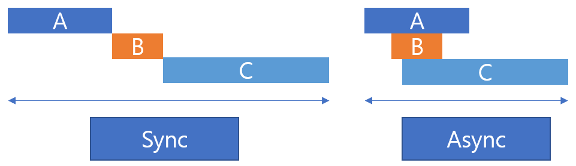

# 비동기 제어 
IoT 시스템에서는 센서 데이터를 수집하고 조건에 따라 실시간으로 액추에이터를 제어해야 합니다. 이때, 비동기 프로그래밍 기법을 활용하면 다수의 센서/장치를 동시에 처리할 수 있습니다.

## 동기방식과 비동기 방식의 차이 
예를 들어 A,B,C 라는 작업을 수행하는데, 작업에 수행되는 시간이 A는 5초, B는 10초, C 는 15초 가 걸린다고 가정해보겠습니다. 이를 순차적으로 처리하면 총 30초의 시간이 소요됩니다. 하지만 작업을 순차적으로 처리하는것이 아닌 비동기 방식으로 처리하면 약 15초 정도에 처리가 가능해집니다. 



동기 방식과 비동기 방식을 요약해서 정리하면 다음과 같이 정리할 수 있습니다. 

| 항목 | 동기 방식 | 비동기 방식 |
|:-------|:------|:------|
| 실행 방식 | 순차 실행 | 동시 실행 | 
| 총 작업 시간 | 모든 작업 시간 누적 | 가장 긴 작업 시간에 수렴 | 
| 사용 예시 | DB 트랜잭션, 시리얼 처리 등 | 센서 데이터 수집, 네트워크 요청 등 | 

### 동기 방식 예시 
```python
import time

def task_sync(name, duration):
    print(f"{name} 시작")
    time.sleep(duration)
    print(f"{name} 완료")

def run_sync_tasks():
    start = time.time()
    task_sync("A", 5)
    task_sync("B", 10)
    task_sync("C", 15)
    end = time.time()
    print(f"총 소요 시간: {end - start:.2f}초")

if __name__ == "__main__":
    run_sync_tasks()
```

### 비동기 방식 예시 
```python
import asyncio
import time

async def task_async(name, duration):
    print(f"{name} 시작")
    await asyncio.sleep(duration)
    print(f"{name} 완료")

async def run_async_tasks():
    start = time.time()
    await asyncio.gather(
        task_async("A", 5),
        task_async("B", 10),
        task_async("C", 15)
    )
    end = time.time()
    print(f"총 소요 시간: {end - start:.2f}초")

if __name__ == "__main__":
    asyncio.run(run_async_tasks())
```

## asyncio 
asyncio는 파이썬에서 비동기 I/O 처리하기위한 표준 라이브러리 모듈입니다. 복잡한 스레드나 프로세스 없이도, 단일 스레드 내에서 수많은 네트워크 요청, 타이머 웹소켓 과 같은 작업들을 효율 적으로 동시 실행 할 수 있게 해줍니다. 

### asyncio 작동 원리 
asyncio는 이벤트 루프 기반으로 동작합니다. 1개의 이벤트 루프가 존재하며 "async def" 로 정의된 코루틴(coroutine) 들이 등록됩니다. await 키워드를 통해 작업중인 비동기 작업을 일시 중단하고 대기중인 다른 작업을 수행할 수 있게 합니다. 

### 주요 구성 요소 

- async def : 비동기 함수 정의, 코루틴 객체를 생성 
- await : 코루틴 실행 중 일시 중단, 호출시 다른 작업에 CPU 양보 
- asyncio.run() : 이벤트 루프 생성 및 코루틴 실행 
- asyncio.create_task() : 여러 코루틴을 통시에 실행하는 태스크 
- asyncio.sleep() : 비동기 타이머, 논블로킹으로 실행
    - time.sleep() 을 사용하면 블로킹 상태로 비동기 처리와는 맞지 않음! 

## 비동기 센서 데이터 수집 
### 온/습도, 조도 데이터 수집 1 (동기 방식)
XHome의 TPHG 센서와 Light 센서를 활용한 센서 데이터 수집 입니다. 우선 순차적으로 수집하여 화면에 출력하는 방식의 코드입니다. 

```python
import time 
from xhome.sensors import Light, Tphg  

light = Light()
tphg = Tphg()

def monitor_tphg():
    data = tphg.read()
    print(f" Temp: {data['temperature']}°C / Humidity: {data['humidity']}% ")
    time.sleep(5)

def monitor_light():
    data = light.read()
    print(f" Lux: {data}")
    time.sleep(2)

def main():
    while True:
        monitor_tphg()
        monitor_light()

if __name__ == "__main__":
    main()
```

### 온/습도, 조도 데이터 수집 2 (비동기 방식)
동기식으로 수집하던 센서 데이터를 비동기 형태로 수집하는 방식으로 변경하면 다음과 같이 구성할 수 있습니다. asyncio 모듈을 활용하고, time.sleep() 으로 지연 발생하던것을 asyncio.sleep() 을 통해 CPU를 점유하지 않고 다른 작업을 진행 할 수 있도록 구성한것입니다. 

```python
import asyncio
from xhome.sensors import Light, Tphg  

light = Light()
tphg = Tphg()

async def monitor_tphg():
    while True:
        data = tphg.read()
        print(f" Temp: {data['temperature']}°C / Humidity: {data['humidity']}% ")
        await asyncio.sleep(5)

async def monitor_light():
    while True:
        data = light.read()
        print(f" Lux: {data}")
        await asyncio.sleep(2)

async def main():
    tphg_task = asyncio.create_task(monitor_tphg())
    light_task = asyncio.create_task(monitor_light())
    while True:
        await asyncio.sleep(0)

if __name__ == "__main__":
    asyncio.run(main())
```

### 조건에 따른 태스크 종료 
앞선 비동기 구조에서 한걸음 더 나아가, 특정 조건에 따라 태스크를 동적으로 종료하는 구조입니다. 이벤트를 통해 각 태스크간의 신호를 전달할 수 있도록 구현하는것이 핵심입니다. 

```python
import asyncio
from xhome.sensors import Light, Tphg  

light = Light()
tphg = Tphg()

LUX_THRESHOLD = 50  

async def monitor_tphg():
    try:
        while True:
            data = tphg.read()
            print(f" Temp: {data['temperature']}°C / Humidity: {data['humidity']}% ")
            await asyncio.sleep(5)
    except asyncio.CancelledError:
        print("TPHG monitoring cancel")

async def monitor_light(cancel_event):
    while True:
        data = light.read()
        print(f" Lux: {data}")
        if data < LUX_THRESHOLD:
            print(f"Task Cancel Event !")
            cancel_event.set()
            break
        await asyncio.sleep(2)

async def main():
    cancel_event = asyncio.Event()
    tphg_task = asyncio.create_task(monitor_tphg())
    light_task = asyncio.create_task(monitor_light(cancel_event))

    await cancel_event.wait()
    tphg_task.cancel()

    await asyncio.gather(tphg_task, light_task, return_exceptions=True)

if __name__ == "__main__":
    asyncio.run(main())
```

<details>
<summary>연습문제</summary>

## 센서 모니터링 및 조건제어 
다음 조건을 만족하는 프로그램을 작성해보세요 

- 센서 측정 
    - TPHG 센서에서 온도를 측정
    - Light 센서에서 조도를 측정 
- 조건에 따른 제어 
    - 온도가 28도 이상, 조도가 100 이하면 팬을 제어 
- 로그 저장 
    - sensor_log.txt 파일에 비동기 형태로 시간정보를 포함하여 센서 데이터 저장 

</details>