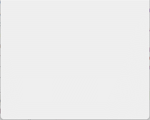
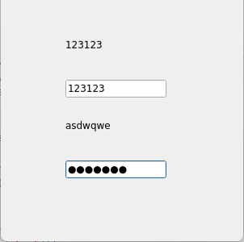
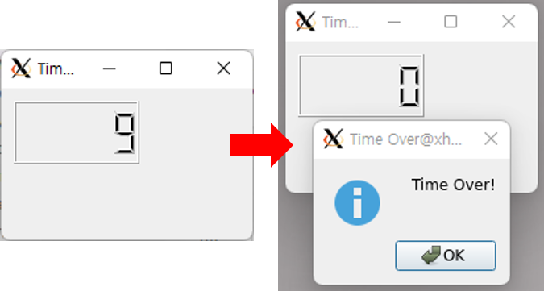
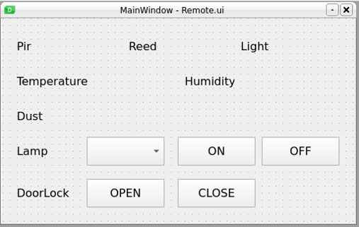

# GUI
GUI(Graphical User Interface)는 사용자가 컴퓨터와 상호작용할 수 있도록 도와주는 시각적인 인터페이스입니다. 명령어 기반의 CLI와 달리, 버튼, 창, 아이콘, 메뉴 등의 그래픽 요소를 통해 보다 직관적이고 사용자 친화적인 환경을 제공합니다. GUI는 CLI(Command Line Interface)에 비해 진입 장벽이 낮으며, 시각적 요소 중심의 피드백을 통해 조작 편의성을 극대화 합니다. 

GUI 프로그램 개발은 다양한 프레임워크를 통해 빠르고 효율적으로 개발이 가능하며, 사용하는 프로그래밍 언어에 따라 효율적인 프레임워크를 선택하여 개발이 가능합니다. 파이썬을 이용하는 대표적인 프레임워크는 Qt, Tkinter, Kivy 등이 있습니다. 

## Qt  
Qt는 크로스 플랫폼 응용 프로그램 및 사용자 인터페이스(UI) 개발을 위한 C++ 기반의 프레임 워크 입니다. Qt는 다양한 운영체제에서 동작하며, 이를 통해 개발자는 한번의 코드 작성으로 여러 플랫폼에서 동작하는 어플리케이션을 만들 수 있습니다. 데스크톱, 모바일, 임베디드 장치 등 다양한 플랫폼을 지원합니다. 

 

Qt는 다양한 기능을 포함하고 있으며, 주요기능 및 상세 내용은 Qt 홈페이지를 참고하시기 바랍니다. 

- [Qt Home Page](https://qt.io/)

### Qt Python binding 
Qt 는 C++ 기반의 프레임워크입니다. 하지만 최근 파이썬 사용자가 늘어나면서 파이썬 기반에서 Qt를 활용할 수 있도록 여러곳에서 파이썬으로 바인딩된 라이브러리를 제공하고 있습니다. 이중 대표적으로 많이 활용되는 것이 PySide와 PyQt 입니다. 두가지 모두 사용이 가능하지만 라이선스나 지원 범위 APi등의 차이가 있습니다. 두가지의 차이점을 정리하면 다음과 같이 정리할 수 있습니다. 

| 항목 | PySide | PyQt |
|:-------|:------:|:------:|
| 정식 명칭 | Qt for Python | PyQt5 / PyQt6 | 
| 제작사 | Qt Company | Riverbank Computing | 
| 라이선스 | LGPL(무료 상업용 사용 가능) | GPL(무료) 또는 상업용 라이선스 유료 | 
| API 유사성 | Qt C++ API와 거의 동일 | 일부 비슷한 내용이 있지만, 함수 명칭 등의 차이가 있음 | 
| 최신 버전 | PySide6(Qt 6.x) | PyQt6(Qt 6.x) | 

### PySide 설치 
XHome 에는 PySide6가 기본적으로 설치되어 있습니다. 별도의 버전이나 데스크톱이나 랩톱에 설치하는 경우에 다음과 같은 명령으로 설치하여 활용할 수 있습니다. 
- pip3 install pyside6 

## First Qt Program
처음 작성해볼 GUI 프로그램은 별다른 기능을 포함하지 않은 상태에서 1개의 창을 생성하는것 입니다. 

```python
import sys
from PySide6.QtWidgets import QApplication, QWidget

app = QApplication(sys.argv)

window = QWidget()
window.setWindowTitle('Empty Window program')
window.setGeometry(100, 100, 300, 240)
window.show()

app.exec()
```

프로그램 시작을 위해 PySide6.QtWidgets 모듈에서 QApplication과 QMainWindow 클래스를 import 합니다. 그리고 Qt 프로그램은 반드시 QApplication 객체를 가져야합니다. 
>- QApplication의 역활 
>    - 애플리케이션 초기화: 애플리케이션을 시작하기 위해 필요한 리소스를 초기화하고, 운영체제와의 상호 작용 설정
>    - 이벤트 루프 실행: app.exec() 메서드를 통해 애플리케이션의 이벤트 루프 시작
>        - 이벤트 루프는 마우스 클릭, 키보드 입력, 창 크기 조절 등 사용자의 입력과 시스템 이벤트를 처리하고, 이를 애플리케이션의 위젯에 전달하여 적절한 동작을 수행하도록 함
>    - 애플리케이션 설정 관리: 애플리케이션 전반의 설정, 스타일, 테마 등을 관리
>    - 위젯 트리 관리: 애플리케이션의 모든 위젯은 트리 형태로 구성됨
>        - QApplication 객체는 이 위젯 트리의 루트 역할을 하며, 위젯의 생성, 소멸, 관리 등을 담당
>    - 리소스 관리: 애플리케이션에서 사용하는 이미지, 폰트, 번역 파일 등의 리소스를 로드하고 관리

QWidget은 모든 사용자 인터페이스 객체의 기본 클래스입니다. 즉, 버튼, 레이블, 텍스트 상자 등 화면에 보이는 모든 UI 요소들은 QWidget을 상속받아 만들어집니다. QWidget은 자체적으로 화면에 나타날 수도 있고, 다른 QWidget 객체의 자식으로 포함되어 복잡한 UI를 구성하는 데 사용될 수도 있습니다.

실행 결과는 다음과 같습니다. 

 

## 시그널과 슬롯 
Qt의 시그널과 슬롯은 객체 간의 통신을 위한 강력한 메커니즘입니다. 마치 특정 사건을 알리는 신호와 이 신호에 반응하는 행동처럼, 시그널과 슬롯은 객체들이 서로 유기적으로 동작하도록 돕습니다.

시그널은 객체에서 특정 이벤트가 발생했을 때 방출되는 신호입니다. 예를 들어 버튼이 클릭되거나 값이 변경되는 등의 상황에서 시그널이 방출됩니다. 그에 반해 슬롯은 시그널에 연결된 함수로, 시그널이 방출될 때 자동으로 호출되어 특정 작업을 수행합니다.

시그널과 슬롯을 사용하면 객체 간의 직접적인 연결 없이도 유연하게 통신할 수 있으며, 코드의 재사용성과 유지보수성을 높일 수 있습니다.

## 위젯 시그널 처리 
Qt에서 위젯의 시그널 처리는 이벤트 기반 프로그래밍의 핵심입니다. 사용자 인터페이스에서 발생하는 다양한 이벤트(마우스 클릭, 키보드 입력, 창 크기 조정 등)에 대해 위젯이 어떻게 반응하고 동작할지 결정하는 방식입니다.

위젯의 시그널 처리 과정은 다음과 같습니다.

- 이벤트 발생: 사용자가 버튼을 클릭하거나 텍스트 상자에 입력하는 등의 동작을 하면 위젯에서 이벤트가 발생함
- 시그널 방출: 이벤트가 발생하면 위젯은 해당 이벤트에 해당하는 시그널 방출
- 슬롯 연결: 개발자는 시그널과 슬롯을 연결하여 특정 시그널이 방출될 때 어떤 함수(슬롯)가 실행될지 지정
- 슬롯 실행: 시그널이 방출되면 연결된 슬롯 함수가 자동으로 호출되어 이벤트에 대한 동작 수행

## Label & Button 
Label과 PushButton은 GUI에서 가장 기본적이며 자주 사용되는 위젯입니다.

Label은 텍스트나 이미지를 표시하는 용도로 사용되며, 주로 정보를 전달하는 데 활용됩니다.
다만 Label은 사용자 입력이나 이벤트에 대한 직접적인 상호작용 기능은 제공하지 않습니다.

반면, PushButton은 사용자가 특정 동작을 수행하도록 유도할 때 사용됩니다.
예를 들어, 버튼을 클릭하여 프로그램을 실행하거나 기능을 전환하는 등의 인터랙션에 주로 활용됩니다.

아래 코드는 2개의 Label 과 2개의 PushButton 을 배치하고, PushButton 을 클릭 할때 Label 의 출력되고 있는 문자를 변경하는 코드입니다. 

```python
import sys
from PySide6.QtWidgets import QApplication, QWidget, QLabel, QPushButton
from PySide6.QtCore import Qt

class Window(QWidget):
    def __init__(self):
        super().__init__()
        self.setWindowTitle('Label')
        self.setGeometry(100, 100, 300, 240)

        self.label1 = QLabel(self)
        self.label1.setGeometry(10,10,100,30)
        self.label1.setAlignment(Qt.AlignmentFlag.AlignCenter)
        self.label1.setText('Label 1')
        self.font1 = self.label1.font()
        self.font1.setPointSize(20)
        self.label1.setFont(self.font1)

        self.btn1 = QPushButton(self)
        self.btn1.setGeometry(130, 10, 50, 30)
        self.btn1.setText("Push")
        self.btn1.clicked.connect(self.on_clicked1)

        self.label2 = QLabel(self)
        self.label2.setAlignment(Qt.AlignmentFlag.AlignRight)
        self.label2.setGeometry(10,70,100,30)
        self.label2.setText('Label 2')
        self.font2 = self.label2.font()
        self.font2.setPointSize(15)
        self.font2.setFamily('Times New Roman')
        self.font2.setBold(True)
        self.label2.setFont(self.font2)
        self.label2.setStyleSheet("color : green; background-color: white")

        self.btn2 = QPushButton(self)
        self.btn2.setGeometry(130, 70, 50, 30)
        self.btn2.setText("Push")
        self.btn2.clicked.connect(self.on_clicked2)

        self.btn1_toggle = True
        self.btn2_toggle = True

    def on_clicked1(self):
        if self.btn1_toggle:
            self.label1.setText("Hi")
            self.btn1_toggle = False
        else:
            self.label1.setText("Bye")
            self.btn1_toggle = True

    def on_clicked2(self):
        if self.btn2_toggle:
            self.label2.setText("On")
            self.btn2_toggle = False
        else:
            self.label2.setText("Off")
            self.btn2_toggle = True

app = QApplication(sys.argv)

window = Window()
window.show()

app.exec()
```

작성된 코드는 2개의 Label을 생성하여 각각 'Label 1', 'Label 2' 라는 문자를 설정하여 출력하고, 2개의 PushButton은 'Push' 문자를 설정하여 출력합니다.

Label 과 PushButton 에 설정된 문자는 setAlignment() 를 통해 정렬 기능을 사용할 수 있습니다. 설정가능한 정렬 기능은 다음과 같습니다. '|' 를 통해 조합하여 활용도 가능합니다. 

- Qt.AlignmentFlag.AlignLeft : 좌측 정렬 
- Qt.AlignmentFlag.AlignCenter : 중앙 정렬 
- Qt.AlignmentFlag.AlignRight : 우측 정렬 
- Qt.AlignmentFlag.AlignTop : 상단 정렬 
- Qt.AlignmentFlag.AlignBottom : 하단 정렬 

PushButton을 사용자가 클릭 했을때 발생하는 이벤트를 처리하기 위해 2개의 메소드를 작성하여 clicked.connect() 를 통해 연결합니다. 
사용자가 버튼을 클릭했을때 연결된 메소드가 호출되어 실행되며, 이때 원하는 액션을 구현하면됩니다. 앞의 코드는 Label 의 문자를 변경합니다. 

실행 결과는 다음과 같습니다.

 

## LineEdit
LineEdit 은 한줄의 문자열 혹은 숫자를 입력할 수 있는 위젯입니다. 여러줄의 문자열을 입력받고 싶은 경우에는 TextEdit을 활용하면 됩니다. 

LineEdit의 기능중 setEchoMode() 를 활용하여 일반적인 문자를 입력받는 경우와 비밀번호와 같이 외부에 노출되서는 안되는 문자를 입력받는 기능을 구현해 보겠습니다. 

```python
import sys
from PySide6.QtWidgets import QApplication, QWidget, QLabel, QLineEdit

class Window(QWidget):
    def __init__(self):
        super().__init__()

        self.label1 = QLabel('Normal Mode Line Edit',self)
        self.label1.move(80, 50)

        self.le1 = QLineEdit(self)
        self.le1.move(80, 100)
        self.le1.textChanged[str].connect(self.onLine1Changed)

        self.label2 = QLabel('Password Mode Line Edit',self)
        self.label2.move(80, 150)

        self.le2 = QLineEdit(self)
        self.le2.setEchoMode(QLineEdit.Password)
        self.le2.move(80, 200)
        self.le2.textChanged[str].connect(self.onLine2Changed)

        self.show()
        self.resize(300,300)

    def onLine1Changed(self, text):
        self.label1.setText(text)
        self.label1.adjustSize()

    def onLine2Changed(self, text):
        self.label2.setText(text)
        self.label2.adjustSize()

app = QApplication(sys.argv)

window = Window()
window.show()

app.exec()
```

2개의 Label과 2개의 LienEdit 을 표기하고, LineEdit 에 문자를 입력하면 각 Label에 입력한 문자가 출력됩니다. 두개의 차이는 setEchoMode()의 설정 여부인데, QLineEdit.Password 로 설정하면 비밀번호 입력과 같이 입력된 문자가 표기되지 않습니다. 

 

## QTimer
QTimer는 지정된 시간 가격마다 특정 작업을 자동으로 수행하도록 도와주는 클래스입니다. 
주기적으로 화면을 갱신해야하거나, 일정 시간동안 동작 후 멈춰야하거나, 시간 제한 기능을 만들 때 사용됩니다. 

```python
import sys
from PySide6.QtWidgets import QApplication, QWidget, QLCDNumber, QMessageBox
from PySide6.QtCore import Signal, QTimer

class Window(QWidget):
    timeSignal = Signal(int)

    def __init__(self):
        super().__init__()
        self.setWindowTitle('Timer program')
        self.setGeometry(100, 100, 200, 120)

        self.timeSignal.connect(self.update_time)

        self.lcd = QLCDNumber(self)
        self.lcd.setGeometry(10,10,100,50)
        self.lcd.display(10)

        self.timer = QTimer(self)
        self.timer.setInterval(1000)
        self.timer.timeout.connect(self.timeout)
        self.timer.start()
    
    def timeout(self):
        self.timeSignal.emit(self.lcd.intValue())

    def update_time(self, value):
        if value == 0:
            QMessageBox.information(self, 'Time Over', 'Time Over!', QMessageBox.StandardButton.Ok)
            self.timer.stop()
        else:
            self.lcd.display(str(value-1))

app = QApplication(sys.argv)

window = Window()
window.show()

app.exec()
```

작성한 프로그램은 10초간 카운트다운이 시작되며 0초가되면 메시지박스와 함께 종료되었음을 나타냅니다. 이때 카운트다운은 Timer를 통해 설정하는데 setInterval()에 설정된 값은 밀리초(ms) 입니다. 
타이머는 시그널 설정을하여 활용하는것이 일반적이며, 설정된 타이머 간격마다 시그널을 발생하여 동작을 수행합니다. 여기서는 1초마다 timeout() 메소드를 호출하도록 되어 있습니다. timeout 메소드에서는 현재 값을 전달하는데 전달된 값이 0 이면 메시지 박스를 호출하여 종료되었음을 알리고, 아니라면 1씩 감소하여 LCD에 갱신합니다. 

 

## 숫자 맞추기 게임 
단순한 숫자 맞추기 게임을 구현해 보겠습니다. 구현할 게임은 다음의 조건을 충족해야합니다. 
>- 정보 표기용 Label 
>    - 처음 실행시 입력 숫자 범위 안내 
>    - 숫자 입력 후 버튼 클릭에 따라 입력한 숫자가 생성된 목표에 비교하여 큰 값인지, 작은값인지 표기 
>    - 정답을 맞췄을때 'Game Over.' 문구를 통해 종료됨을 안내 
>- 숫자 입력용 TextEdit
>- 결과 확인용 PushButton
>    - 버튼 클릭시 TextEdit에 입력된 숫자와 정답을 비교하여 정답이 아니라면 상태에 따라 정보 표기용 Label에 문구 출력 
>    - 정답인 경우 메시지 박스를 출력하여 게임이 종료됨을 알리고, 몇번만에 숫자를 맞췄는지 표기 
>    - 새로운 게임을 시작할것인지 물어보며, Yes인 경우 난수를 다시 생성하고 게임을 다시 시작하며 No라면 현재 상태 유지 
>- 난수 생성 
>    - 게임 시작 및 재시작의 경우에 난수를 생성하며, 1~100 의 값을 지니도록 설정 

### UI 구성 
UI는 다음 코드와 같이 작성할 수 있습니다. 창의 크기는 279x146 으로 설정되어 있으며 TextEdit, PushButton, Label을 각각 1개씩 배치합니다. 

각 위젯은 setGeometry()를 통해 위치를 설정합니다. 여기서 QRect()에 전달되는 4개의 숫자는 (x 좌표 시작, y 좌표 시작, 가로 넓이, 세로 넓이) 입니다. 

아래 코드는 num_ui.py 로 저장합니다. 
```python
from PySide6 import QtCore, QtGui, QtWidgets

class Ui_Form(object):
    def setupUi(self, Form):
        Form.setObjectName("Form")
        Form.resize(279, 146)
        self.textEdit = QtWidgets.QTextEdit(parent=Form)
        self.textEdit.setGeometry(QtCore.QRect(20, 50, 231, 31))
        self.textEdit.setObjectName("textEdit")
        self.submitBtn = QtWidgets.QPushButton(parent=Form)
        self.submitBtn.setGeometry(QtCore.QRect(20, 90, 231, 24))
        self.submitBtn.setObjectName("submitBtn")
        self.infoLabel = QtWidgets.QLabel(parent=Form)
        self.infoLabel.setGeometry(QtCore.QRect(20, 20, 181, 16))
        font = QtGui.QFont()
        font.setPointSize(10)
        self.infoLabel.setFont(font)
        self.infoLabel.setObjectName("infoLabel")

        self.retranslateUi(Form)
        QtCore.QMetaObject.connectSlotsByName(Form)

    def retranslateUi(self, Form):
        _translate = QtCore.QCoreApplication.translate
        Form.setWindowTitle(_translate("Form", "Form"))
        self.submitBtn.setText(_translate("Form", "Submit"))
        self.infoLabel.setText(_translate("Form", "Input any number (0~100)"))
```

이렇게 작성된 코드는 동작 구현 코드에서 import 하여 사용 가능합니다. 여기서 작성한 UI 코드는 위젯의 위치나 크기 등을 하나씩 코드로 작성해야하기 때문에 불편함이 있습니다. UI 배치와 구성을 조금더 쉽게 활용하는 방법에 대해서는 다음 작성할 프로그램에서 소개하겠습니다. 

### 숫자 맞추기 어플리케이션 
이제 앞서 작성한 UI 코드를 활용하여 창을 실행하고 게임 동작에 관련된 코드를 작성하여 게임을 실행해보도록 하겠습니다. 우선 작성할 코드의 전체 내용은 다음과 같습니다. 

```python
import sys
import random
from PySide6.QtWidgets import QApplication, QWidget, QMessageBox
from num_ui import Ui_Form

class Window(QWidget):
    def __init__(self):
        super().__init__()
        self.ui = Ui_Form()
        self.ui.setupUi(self)
        self.init_ui()

    def init_ui(self):
        self.wrongCnt = 0
        self.correctNum = random.randint(1,101)
        self.ui.submitBtn.clicked.connect(self.check_num)
    
    def check_num(self):
        if int(self.ui.textEdit.toPlainText()) == self.correctNum:
            reply = QMessageBox.information(self, 'Game Over', f'Correct!\nYou entered it wrong {self.wrongCnt} times.\nDo you want play again?', QMessageBox.StandardButton.Yes | QMessageBox.StandardButton.No )
            if reply == QMessageBox.StandardButton.Yes:
                self.wrongCnt = 0
                self.correctNum = random.randint(1,101)
                self.ui.infoLabel.setText("Input any number (0~100)")
            else:
                self.ui.infoLabel.setText("Game Over.")
        else:
            self.wrongCnt += 1
            if int(self.ui.textEdit.toPlainText()) > self.correctNum:
                self.ui.infoLabel.setText("It's a bigger number.")
            else:
                self.ui.infoLabel.setText("It's a smaller number.")

app = QApplication(sys.argv)
window = Window()
window.show()
app.exec()
```

구성은 단순합니다. 게임이 시작되면 1~100 숫자중 1개의 난수를 정답으로 저장하고 사용자가 입력한 숫자가 있다면 정답과 비교하여 정답이 아닌경우 현재 입력한 숫자가 큰 숫자인지, 작은 숫자인지 Label에 출력합니다. 이를 반복하여 정답을 맞추면 메시지 박스와 함께 정답을 몇번만에 맞췄는지 나타냅니다. 

QMessageBox 는 별도의 UI 구성 없이 알림 용도로 활용가능한 윈도우로 간단한 선택을 요구하거나, 정보를 알릴때 활용됩니다. 알리고 싶은 메시지를 작성하여 전달하면 되며, 선택 버튼 혹은 확인 버튼등을 추가 하고 싶다면 원하는대로 추가 가능합니다. 아래 그림은 게임 실행 과정을 간략하게 표현한 그림입니다. 


## 나만의 XHome Controller 
앞서 작성한 내용을 바탕으로 XHome 제어 프로그램을 작성해 보겠습니다. 작성할 프로그램에 필수로 적용되어야 하는 내용은 다음과 같습니다. 
>- 센서 데이터 
>    - 표기할 센서 목록
>        - Pir, Reed, Light, Temperature, Humidity, Dust
>    - 센서 데이터 갱신 주기는 1초 
>- 액츄에이터 
>    - Lamp 
>        - 동작 시킬 Lamp 위치 선택 후 On 또는 Off 버튼에 따른 제어 
>    - DoorLock    
>        - Open 또는 Close 버튼 제어에 따른 제어 

### UI 구성
앞서 작성한 숫자 맞추기 게임의 UI 구성은 별도의 UI 구성툴을 활용하지 않고 코드로 직접 하나씩 작성한 형태로 위젯의 배치를 좌표로 하나씩 지정해야 하기에 수정하기에 불편한점이 있습니다. 이번에는 Qt에서 UI 구성을 위해 제공하는 Qt Designer 를 활용하여 별도의 코드를 작성하지 않고 UI 배치를 진행 해보겠습니다. 

Qt Designer는 PySdie6를 설치할때 함께 설치되며 다음 명령을 통해 실행할 수 있습니다. 
```sh
pyside6-designer 
```


Qt Designer는 UI 환경에서 원하는 위젯을 선택적으로 드래그&드롭 을 통해 배치하고 크기를 조정할 수 있습니다. 앞서 코드를 통해 작성하는 방법 보다는 보다 수월하고 빠르게 UI를 구성할 수 있습니다. 

새로운 UI 생성을 진행합니다. 생성할 UI는 Templates를 선택합니다. "Main Window" 를 선택하면 기본적인 창 구성이 가능합니다. 다음은 XHome Controller UI 구성입니다. 



앞의 그림에 표기된 UI 에는 눈으로 확인되지 않는 Label을 포함하여 14개의 Label과 4개의 PushButton, 1개의 ComboBox로 이루어집니다. 각각의 위젯의 기본값 설정은 다음과 같습니다. 

**여기서 Geometry 는 꼭 아래의 내용을 따르지 않아도 되며 원하는 대로 구성해도 관계 없습니다.**

| Class | Object Name | Description | Geometry | Default Value | 
|:-------|:------|:------|:------|:------|
| QLabel | PirLbl | 문자 표기 | [(20,20),41x41] | Pir |
| QLabel | PirValueLbl | 센서 데이터 표기 | [(70,20),81x41] | --- |
| QLabel | ReedLbl | 문자 표기 | [(180,20),41x41] | Reed |
| QLabel | ReedValueLbl | 센서 데이터 표기 | [(240,20),81x41] | --- |
| QLabel | LightLbl | 문자 표기 | [(340,20),41x41] | Light |
| QLabel | LightValueLbl | 센서 데이터 표기 | [(390,20),81x41] | --- |
| QLabel | TempLbl | 문자 표기 | [(20,70),101x41] | Temperature |
| QLabel | TempValueLbl | 센서 데이터 표기 | [(130,70),101x41] | --- |
| QLabel | HumiLbl | 문자 표기 | [(260,70),71x41] | Humidity |
| QLabel | HumiValueLbl | 센서 데이터 표기 | [(340,70),101x41] | --- |
| QLabel | DustLbl | 문자 표기 | [(20,120),61x41] | Dust |
| QLabel | DustValueLbl | 센서 데이터 표기 | [(110,120),291x41] | --- |
| QLabel | LampLbl | 문자 표기 | [(20,170),91x41] | Lamp |
| QComboBox | LampCB | 제어 위치 선택 | [(120,170),111x41] | --- |
| QPushButton | LampOnBtn | 램프 켜기 | [(250,170),111x41] | ON |
| QPushButton | LampOffBtn | 램프 끄기 | [(370,170),111x41] | OFF |
| QLabel | DoorLbl | 문자 표기 | [(20,230),91x41] | DoorLock |
| QPushButton | dOpenBtn | 도어락 열기 | [(120,230),111x41] | OPEN |
| QPushButton | dCloseBtn | 도어락 닫기 | [(250,230),111x41] | CLOSE |

작성한 파일을 Remote.ui 로 저장합니다. .ui 확장자를 사용하는 파일은 Qt Designer로 만든 GUI 레이아웃을 저장하는 XML 형식의 파일입니다. 파이썬 코드를 작성하지 않고 UI의 구성 요소를 설계하고 저장할 수 있습니다. 이 파일을 파이썬파일로 변환할 수 있습니다. 
```sh
pyside6-uic <file_name>.ui -o <file_name2>.py
```

작성한 Remote.ui 파일을 변환하게되면 다음과 같은 명령으로 파이썬 파일로 변환할 수 있습니다. 
```sh
pyside6-uic Remote.ui -o Remote.py 
```

이렇게 생성된 UI 관련 파이썬 파일은 파일을 직접 수정해서 활용도 가능합니다. 이제 이 파일을 어플리케이션 프로그램에서 import 해서 활용하면 됩니다. 

### XHome Controller 어플리케이션  
UI 파일을 기반으로 동작 코드를 구현합니다. 센서 데이터 자동 갱신을 위해 타이머를 구성하고 램프 및 도어락 제어를 위한 버튼의 동작을 정의합니다. 램프의 경우 위치 선택을 위해 ComboBox를 구성하고 ComboBox의 아이템을 ["entrance","livingroom","kitchen","room","bathroom"] 으로 설정합니다. 

```python
import sys
from PySide6.QtWidgets import QApplication, QMainWindow
from PySide6.QtCore import QTimer 
from Remote import Ui_MainWindow
from xhome.sensors import Pir, Reed, Light, Tphg, Dust
from xhome.actuator import Lamp, DoorLock

class Window(QMainWindow):
    def __init__(self):
        super().__init__()
        self.ui = Ui_MainWindow()
        self.ui.setupUi(self)
        self.__pir = Pir()
        self.__reed = Reed()
        self.__light = Light()
        self.__tphg = Tphg()
        self.__dust = Dust() 
        self.__lamp = Lamp() 
        self.__doorlock = DoorLock() 
        self.ui.LampCB.addItems(["enterace","livingroom","kitchen","room","bathroom"])
        self.ui.dOpenBtn.clicked.connect(self.doorlock_clicked)
        self.ui.dCloseBtn.clicked.connect(self.doorlock_clicked)
        self.ui.LampOnBtn.clicked.connect(self.lamp_clicked)
        self.ui.LampOffBtn.clicked.connect(self.lamp_clicked)
        self.timer = QTimer(self)
        self.timer.setInterval(1000)
        self.timer.timeout.connect(self.sensor_update)
        self.timer.start()

    def sensor_update(self):
        self.ui.PirValueLbl.setText(self.__pir.read())
        self.ui.ReedValueLbl.setText(self.__reed.read())
        self.ui.LightValueLbl.setText(str(self.__light.read()))
        temp = self.__tphg.read()
        self.ui.TempValueLbl.setText(str(temp['temperature']))
        self.ui.HumiValueLbl.setText(str(temp['humidity']))
        temp = self.__dust.read()
        self.ui.DustValueLbl.setText("1.0 : "+str(temp['1.0'])+", 2.5 : "+str(temp['2.5'])+", 10 : "+str(temp['10']))
    
    def lamp_clicked(self):
        if self.sender().text() == "ON":
            self.__lamp.on(self.ui.LampCB.currentText())
        else:
            self.__lamp.off(self.ui.LampCB.currentText())

    def doorlock_clicked(self):
        if self.sender().text() == "OPEN":
            self.__doorlock.open()
        else:
            self.__doorlock.close()

app = QApplication(sys.argv)
window = Window()
window.show()
app.exec()
```

