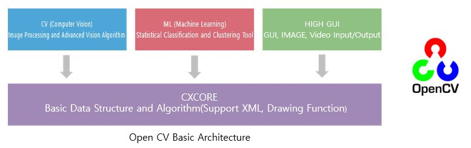
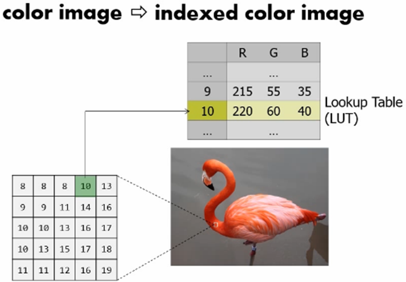
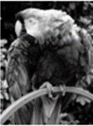
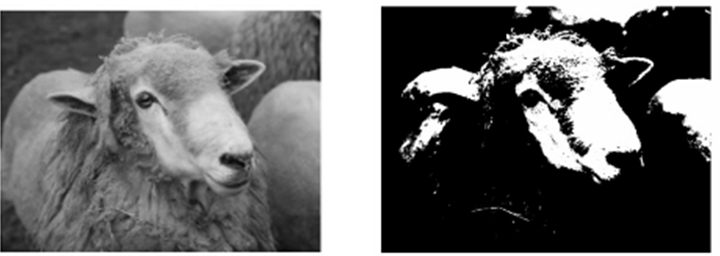
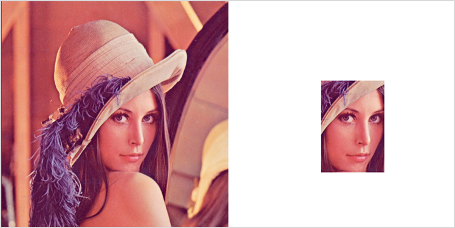
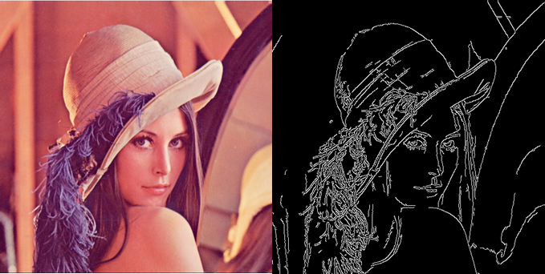

# OpenCV
OpenCV는 인텔에서 오픈 소스 기반으로 개발된 실시간 이미지 프로세싱 전용 라이브러리입니다. 윈도우에서 C++ 기반으로 개발이 시작되었으며 현재는 Java와 Python 등으로 확장되었습니다. OpenCV는 윈도우이외에 리눅스, 안드로이드 등 다양한 운영체제를 지원합니다. 또한 BSDBerkely Software Distribution 라이선스로 소스코드 공개 의무가 없어 상업적으로도 많이 활용됩니다. OpenCV는 이진화를 비롯하여 노이즈 제어, 외곽선 검출, 이미지 변환, 패턴 인식, 기계 학습에 이르기까지 대부분의 알고리즘이 구현되어 있습니다. 



## 디지털 이미지 
디지털 이미지는 자연계의 사물, 혹은 장면을 데이터화 하여 컴퓨터를 통해 시각화할 수 있게 만든 자료입니다. 2차원 행렬 형태로 표현되며 각 격자는 하나의 픽셀로 비트맵 이미지라고도 합니다. 

### 컬러 이미지 
각 픽셀을 24비트로 표현하는 이미지로 R,G,B 3개의 채널로 구성되어 있으며 각각이 8비트로 표현됩니다. 1픽셀의 데이터가 3바이트로 전체 이미지의 용량이 큽니다. 컬러 이미지의 용량을 줄이기 위한 방법으로 룩업 테이블을 활용하기도 합니다. 



### 그레이 스케일 이미지 
컬러 이미지와는 다르게 픽셀당 데이터가 8비트로 구성된 이미지입니다. 8비트로 구성되어 있기 때문에 흰색부터 검은색까지 256단계의 명암을 표현하는 회색조 이미지로 색상 채널이 없는 것이 특징입니다.  



### 바이너리 이미지 
여기서 소개하는 이미지의 종류중 가장 작은 용량을 가지는 이미지입니다. 픽셀의 데이터가 각 1비트로 표현되는 이미지로 흑백을 표현하는 이미지입니다. 주로 그레이 스케일 이미지를 특정 임계점을 기준으로 두 가지 부류로 나눠 바이너리 이미지로 변환합니다. 



## 이미지 다루기 
이미지 파일을 읽은 메소드로는 imread() 메소드를 활용합니다. 파일에서 이미지 정보를 읽어 numpy의 ndarray 객체로 반환해주는 메소드입니다. 파일의 경로를 인자로 전달하며 옵션으로 이미지를 읽어올 때 색상을 어떠한 색상으로 읽을 것인지 선택할 수 있습니다. 아무런 옵션을 지정하지 않는다면 이미지에 지정된 기본 색상정보로 읽어옵니다.

이미지 출력에는 imshow() 메소드를 활용합니다. 새로운 창을 생성하여 이미지를 출력합니다. 새로 생성된 창을 종료할 때는 destoryAllWindows() 메소드를 활용하면 됩니다. 

```python
import cv2 

img = cv2.imread("lena.jpg")
cv2.imshow("Lena", img)
while True:
    if cv2.waitKey(10) == 27:
        break

cv2.destroyAllWindows()
```


## 이미지 색상 변환 
이미지의 색상을 변환할 때는 cvtColor() 메소드를 활용합니다. 인자로 변환할 이미지와 변환할 색상 공간에 대한 정보를 전달하면 색상 정보를 변경한 이미지를 반환해줍니다. cvtColor()에 색상 변환에 관한 인자를 몇 가지 소개하면 다음과 같습니다. 

- cv2.COLOR_BGR2RGB, cv2.COLOR_BGR2GRAY, cv2.COLOR_RGB2HSV, cv2.COLOR_RGB2YUV, cv2.COLOR_YUV2RGBA, etc.. 

여기서는 이미지를 읽어 RGB로 변환하는 과정을 거쳐 화면에 출력해보도록 하겠습니다. 여기서 numpy의 hstack() 메소드를 활용하는대 이는 두 개의 배열을 수평으로 연결하는 역활로 두 개의 이미지를 인자로 전달하면 한 개의 이미지로 합치는 용도로 활용이 가능합니다. 

```python
import cv2 
import numpy as np
import matplotlib.pyplot as plt

opencv_bgr_img = cv2.imread("lena.jpg")
new_rgb_img = cv2.cvtColor(opencv_bgr_img, cv2.COLOR_BGR2RGB)
out_img = np.hstack((opencv_bgr_img, new_rgb_img))

plt.figure()
plt.title("bgr_rgb_lena")
plt.imshow(out_img)
```


## 이미지 크기 변환 
카메라를 통해 찍은 사진 또는 다른 경로를 통해 입수한 이미지는 크기가 모두 동일하지 않습니다. 이러한 이미지들을 가지고 같은 작업을 진행하더라도 각각의 크기의 차이 때문에 특정 위치의 값을 변경하게 되면 픽셀의 위치가 일정하지 않습니다. 또 인공지능 학습에 활용한다면 크기에 따라 학습에 소요되는 시간, 결과를 출력하기 위해 소요되는 시간이 이미지 크기에 따라 많은 차이를 보입니다. 

따라서 빠른 연산 처리, 일정하게 이미지를 다루는 작업등을 진행하기 위해서는 원하는 크기로 이미지를 변환할 수 있어야 합니다. OpenCV에서는 resize() 메소드를 통해 이미지의 크기를 원본보다 크게 혹은 작게 변환이 가능합니다. 크기 변환을 원하는 이미지와, 변환할 크기(절대적 크기 혹은 상대적 크기), 보간법 알고리즘을 전달하면 크기가 변환된 이미지 파일을 반환합니다. 이때 변환할 크기는 튜플 타입의 절대 크기(dstSize)를 전달하면 상대크기는 0으로 지정하거나 입력하지 않고, 절대 크기 튜플을 (0,0) 으로 설정하는 경우에 상대 크기를 지정하는 형태로 사용합니다. 

```python
import cv2

img = cv2.imread("HappyFish.jpg")

m_s = cv2.resize(img, dsize=(240, 240))
m_b = cv2.resize(img, dsize=(1280, 720))

cv2.imshow("img", img)
cv2.imshow("small", m_s)
cv2.imshow("big", m_b)
while True:
    if cv2.waitKey(10) == 27:
        break
cv2.destroyAllWindows()
```

## 이미지 내 관심 영역 
영상 또는 이미지를 다루는 작업에서 전체의 화면 데이터를 활용하는 경우도 있지만 대부분 특정 구역의 픽셀들에서 특징을 추출하거나 색상을 변환하는 일련의 작업을 수행합니다. 이때 작업을 위해 원본 이미지에서 특정 영역을 잘라내는 것을 ROI(Region of Interest)를 지정한다고 합니다. ROI를 지정하는 방식은 데이터화 되어있는 이미지의 특정 구역의 데이터를 따로 저장하는 형태로 지정하는 것이 일반적입니다. 

```python
import cv2
import numpy as np

img = cv2.imread("lena.jpg")
roi_img = np.full_like(img, 255)

x1, y1, x2, y2 = 209, 182, 352, 389
roi = img[y1:y2, x1:x2]

roi_img[y1:y1+(y2-y1), x1:x1+(x2-x1)] = roi

out_img = np.hstack((img, roi_img))

cv2.imshow("lena_face", out_img)
while True:
    if cv2.waitKey(0) == 27:
        break
cv2.destroyAllWindows()
```


## 비디오 다루기 
OpenCV는 이미지뿐만 아니라 비디오나 카메라를 통한 이미지 처리도 가능합니다. 비디오나 카메라를 통해 한 프레임씩 이미지를 받아올 때는 VideoCapture 객체를 활용합니다. 

```python
import cv2

video = cv2.VideoCapture("project_video.mp4")
if video.isOpened():
    while True:
        ret, img = video.read()
        if ret:
            cv2.imshow("video", img)
            if cv2.waitKey(0) == 27:
                break
        else:
            break

cv2.destroyAllWindows()
video.release()
```

## 카메라 다루기 
OpenCV에서 VideoCapture객체는 비디오뿐만 아니라 카메라의 영상을 받는용도로도 활용됩니다. 카메라 장치는 장비 번호로 구분하도록 되어 있고 일반적인 장치에 카메라는 1개 장착되어 있습니다. 여러개인 경우에는 장치 번호에 따라 카메라 장치에 접근 가능합니다. 장치 번호는 0부터 순차적으로 부여되며 VideoCapture 객체에 비디오 파일 경로가 아닌 장치 번호를 입력하면 카메라로 부터 실시간 데이터를 수신할 수 있습니다. 

```python
import cv2

cap = cv2.VideoCapture(0)
while True:
    ret, frame = cap.read()
    cv2.imshow('frame',frame)
    if cv2.waitKey(1) == 27:
        break
```

## 경계선 검출 
캐니 엣지(Canny Edge) 방식은 경계 검출방식에서 가장 많이 활용되는 방식으로 4단계의 알고리즘에 따라 경계를 검출합니다. 4단계는 다음과 같습니다. 

- 5 x 5 가우시안 블러링 필터로 노이즈를 제거 
- 소벨 필터로 경계 및 그레디언트 방향 검출 
- 그레디언트 방향에서 검출된 경계중 가장 큰 값만 선택하고 나머지는 제거 (비최대치 억제) 
- 두 개의 경계 값(Max, Min)을 지정하여 경계 영역에 있는 픽셀들 중 큰 경계값 밖의 픽셀들과 연결성 없는 픽셀을 제거 

복잡한 알고리즘을 통해 경계선을 검출하는 것처럼 보이지만 OpenCV의 Canny() 메소드를 활용하면 손쉽게 사용이 가능합니다. 메소드의 전달 인자로는 입력 이미지, 경계값(Max, Min), 엣지 결괏값을 갖는 2차원 배열(선택 사항), 소벨 마스크에 사용할 커널 크기(선택 사항), 그레디언트 강도를 구할 방식(선택 사항) 이 있습니다. 

```python
import cv2
import numpy as np 

cap = cv2.VideoCapture(0)
while True:
    ret, frame = cap.read()
    canny = cv2.Canny(frame,100,200)
    out = np.hstack((frame, cv2.cvtColor(canny,cv2.COLOR_GRAY2BGR)))
    cv2.imshow('frame',out)
    if cv2.waitKey(1) == 27:
        break
```



