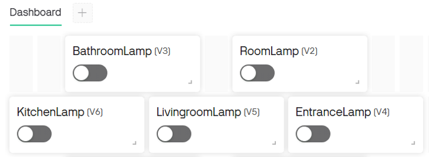
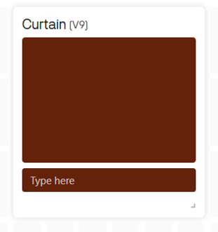
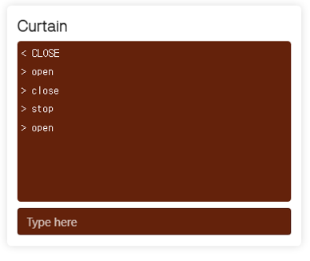

# IoT Dashboard Service 기반 XHome 제어 
"5.1 IoT Dashboard Service" 에서 제어한 내용을 기반으로 간단한 Dashboard를 구성하고 XHome을 제어하거나, 센서데이터를 원격으로 모니터링하는 실습입니다. 

## 원격 램프 제어 
XHome의 Lamp는 5개입니다. 현관, 거실, 주방, 방, 화장실에 각각 1개씩 위치해 있으며, 이를 Web Dashboard를 통해 제어합니다. 

### Datastream 구조 
램프 제어를 위한 Datastrem 설정은 다음과 같습니다. 

| Where | Virtual Pin | Data Type | Min | Max | Default |
|:-------:|:-------:|:------:|:------:|:------:|:------:|
| Room | V2 | Integer | 0 | 1 | 0 | 
| Bathroom | V3 | Integer | 0 | 1 | 0 | 
| Entrance | V4 | Integer | 0 | 1 | 0 | 
| Livingroom | V5 | Integer | 0 | 1 | 0 | 
| Kitchen | V6 | Integer | 0 | 1 | 0 | 

램프의 제어 상태는 "On" 또는 "Off" 두가지 상태입니다. 따라서 정수형태의 데이터로 처리하고 1인경우 "On" 0인경우 "Off"로 구성합니다. 

### Web Dashboard 구성 
Dashbaord에서는 Switch 위젯을 통해 제어를합니다. 5개의 스위치 위젯을 배치하고 각 스위치에 맞는 데이터 스트림을 설정합니다. 아래 그림은 배치 예시 입니다. 



### 제어 코드 
Blynk를 통해 XHome의 Lamp를 제어하는 코드는 다음과 같습니다. 

```python
import BlynkLib
from xhome.actuator import Lamp

blynk = BlynkLib.Blynk('your-token')
lamp = Lamp() 

@blynk.on("V2")
def room_lamp_handler(value):
    if value[0] == '1':
        lamp.on('room')
    elif value[0] == '0':
        lamp.off('room')

@blynk.on("V3")
def bathroom_lamp_handler(value):
    if value[0] == '1':
        lamp.on('bathroom')
    elif value[0] == '0':
        lamp.off('bathroom')

@blynk.on("V4")
def entrance_lamp_handler(value):
    if value[0] == '1':
        lamp.on('entrance')
    elif value[0] == '0':
        lamp.off('entrance')

@blynk.on("V5")
def livingroom_lamp_handler(value):
    if value[0] == '1':
        lamp.on('living')
    elif value[0] == '0':
        lamp.off('living')

@blynk.on("V6")
def kitchen_lamp_handler(value):
    if value[0] == '1':
        lamp.on('ktichen')
    elif value[0] == '0':
        lamp.off('kitchen')

while True:
    blynk.run()
```

## 온도/습도 모니터링 
이번에는 TPHG 센서의 데이터중 온도와 습도 데이터를 Web Dashboard로 모니터링 해보도록 하겠습니다. 

### Datastream 구조 
램프 제어를 위한 Datastrem 설정은 다음과 같습니다. 

| Sensor | Virtual Pin | Data Type | Min | Max | Default |
|:-------:|:-------:|:------:|:------:|:------:|:------:|
| TPHG(Temp) | V7 | Integer | 0 | 50 | 0 | 
| TPHG(Humi) | V8 | Integer | 0 | 100 | 0 | 

### Web Dashboard 구성 
Dashbaord에서는 Label 위젯을 통해 데이터를 표기합니다. Guage 혹은 Chart 위젯을 활용해도 관계 없습니다. 원하는 위젯을 배치하고 데이터 스트림을 설정합니다. 아래 그림은 배치 예시 입니다. 


### 제어 코드 
Blynk를 통해 XHome의 온도/습도 센서를 모니터링하는 코드는 다음과 같습니다. 센서로 부터 수신된 데이터를 1초마다 전달합니다. 

```python
import BlynkLib, time, threading 
from xhome.sensors import Tphg

blynk = BlynkLib.Blynk('your-token')
tphg = Tphg()
run_flag = True

def write_thread():
    global run_flag
    while run_flag:
        data = tphg.read()
        blynk.virtual_write(7, data['temperature'])
        blynk.virtual_write(8, data['humidity'])
        time.sleep(1)

wth = threading.Thread(target=write_thread,daemon=True)
wth.start()

while True:
    try:
        blynk.run()
    except KeyboardInterrupt:
        run_flag = False
        wth.join()
        break
```

## 터미널을 활용한 문자열 처리 
Blynk에서 활용가능한 위젯중에는 Terminal이 있습니다. 이 Terminal은 명령프롬프트와 같이 활용이 가능하며, 문자 혹은 숫자를 입력하여 전달할 수 있습니다. 이 방법을 활용하면 단순 숫자를 수신하여 처리하는 형태보다는 조금더 다양한 처리가 가능합니다. 여기서는 문자를 수신받아서 Curtain을 제어하는 실습을 진행합니다. 

### Datastream 구조 
Cutrain 제어를 위한 Datastrem 설정은 다음과 같습니다. 문자열을 주고 받는 형태이기 때문에 Data Type은 String 입니다. 기본값은 별도로 설정하지 않습니다. 

| Actuator | Virtual Pin | Data Type | 
|:-------:|:-------:|:------:|
| Curtain | V9 | String | 

### Web Dashboard 구성 
Dashbaord에서는 Terminal 위젯을 통해 데이터를 표기합니다. 표기되는 문자를 조금더 많이 표기하고 싶다면 크기는 조정하여 활용합니다. 아래 그림은 배치 예시 입니다. 



### 제어 코드 
Blynk를 통해 XHome의 온도/습도 센서를 모니터링하는 코드는 다음과 같습니다. 센서로 부터 수신된 데이터를 1초마다 전달합니다. 

```python
import BlynkLib
from xhome.actuator import Curtain

blynk = BlynkLib.Blynk('your-token')
curtain = Curtain()

@blynk.on("V9")
def termianl_lamp_handler(value):
    if value[0].lower() == "open":
        curtain.open()
    elif value[0].lower() == "close":
        curtain.close()
    elif value[0].lower() == "stop":
        curtain.stop()

while True:
    blynk.run()
```



## 연습문제 
Blynk 를 활용하여 다음의 조건의 조건을 충족하는 시스템은 구성해 보세요. 

- Switch 위젯을 통한 Room Lamp 제어
    - Illuminance 센서의 데이터가 200 이하인 경우 On 상태 유지 
- Switch 위젯을 통한 Room Fan 제어 
    - TPHG 센서의 Temperature 데이터가 25 이상인 경우 On 상태 유지 
- Guage 위젯을 통한 센서데이터 모니터링 
    - Illuminance 
        - Data Type : Integer 
        - Min : 0 
        - Max : 65535
    - TPHG(Temperature)
        - Data Type : Integer 
        - Min : 0 
        - Max : 50