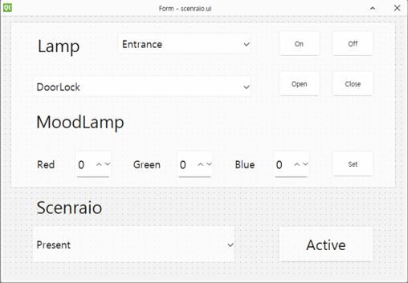

# 자동화 로직 설계 및 구현  
스마트 홈 자동화의 핵심은 다양한 환경 조건에 따라 기기들이 스스로 동작하는 ‘조건부 동작’입니다. 이 장에서는 센서나 시간 정보를 기반으로 전등, 커튼, 환기팬 등의 장치를 자동으로 제어하는 방법을 다룹니다. 예를 들어, 실내 온도에 따라 환기팬이 작동하거나, 외부 밝기에 따라 커튼이 열리고 닫히는 등의 시나리오를 통해 자동화 로직의 구조와 구현 원리를 학습합니다. 또한 사용자가 설정한 자동 모드에 따라 다양한 기기들이 함께 연동되는 통합 제어 방식도 함께 소개합니다.

## 온도 기반 환기팬 제어 
온도가 일정 기준을 초과할 경우 환기팬이 자동으로 작동하도록 제어하는 로직을 구현한 것입니다. Tphg 센서를 통해 현재 온도를 실시간으로 측정하고, 그 값이 임계값을 넘으면 Fan 객체를 통해 환기팬을 켭니다. 반대로 임계값 이하일 경우에는 팬을 꺼서 불필요한 전력 소비를 방지합니다. 임계값은 테스트 환경에 맞춰 조절하여 테스트를 진행하기 바랍니다. 

```python
from xhome.actuator import Fan 
from xhome.sensors import Tphg
import time

threshold = 25

fan = Fan()
tphg = Tphg()

while True:
    temp_data = tphg.read()['temperature']
    if temp_data > threshold:
        fan.on('livingroom')
    else:
        fan.off('livingroom')
    time.sleep(1)
```
<details>
<summary>온도 기반 환기팬 제어 심화</summary>

---
이러한 형태로 구성하게 되면 임계값으로 설정한 온도에 따라 fan이 제어됩니다. 다만, 임계치 이상 혹은 이하인 경우 지속적으로 제어 메시지를 전송하게되어 불필요한 메시지가 지속적으로 전달되기도 합니다. 불필요한 동작을 막기위해 액츄에이터 동작에 따른 피드백 신호를 활용하여 기존 상태와 다른 상태인 경우에만 제어신호를 보내도록 구성하면 다음과 같이 구성할 수 있습니다. 

```python
from xhome.actuator import Fan 
from xhome.sensors import Tphg
import time

threshold = 24

fan = Fan()
tphg = Tphg()

while True:
    temp_data = tphg.read()['temperature']
    fan_state = fan.state
    if temp_data > threshold:
        if fan_state['livingroom'] != "on":
            fan.on('livingroom')
    else:
        if fan_state['livingroom'] != "off":
            fan.off('livingroom')
    time.sleep(1)
```

</details>

## 밝기 기반 커튼 제어 
밝기 수준에 따라 자동으로 커튼을 여닫는 프로그램을 구현하면 다음과 같이 구현할 수 있습니다. 조도 센서를 통해 측정한 밝기 값이 일정 임계값 이상 이면 커튼을 닫고, 반대로 너무 어두운 경우에는 커튼을 엽니다. 밝기가 중간 수준인 경우에는 동작을 중단하여 불필요한 움직임을 방지합니다. 

```python
from xhome.actuator import Curtain 
from xhome.sensors import Light
import time

open_threshold = 25
close_threshold = 500

curtain = Curtain()
light = Light()

while True:
    light_data = light.read()
    if light_data > close_threshold:
        curtain.close()
    elif light_data < open_threshold:
        curtain.open()
    else:
        curtain.stop()
    time.sleep(1)
```

<details>
<summary>밝기 기반 커튼 제어 심화</summary>

---
앞의 기능을 변경하여 자동 모드와 수동모드로 구분하여 동작하도록 구현합니다. 메인에서는 사용자 입력을 받아 자동 모드 혹은 수동 모드를 구분하고, 모드에 따라서 스레드에서는 자동으로 밝기를 감지하여 제어를 시작합니다. 수동 모드인 경우에는 사용자 입력에 따라 커튼을 제어합니다. 

```python
from xhome.actuator import Curtain 
from xhome.sensors import Light
import time
import threading

open_threshold = 25
close_threshold = 500

curtain = Curtain()
light = Light()

mode = 'auto'  
mode_lock = threading.Lock()   

def auto_control_loop():
    global mode
    while True:
        with mode_lock:
            current_mode = mode
        
        if current_mode == 'auto':
            light_data = light.read()
            if light_data > close_threshold:
                curtain.close()
            elif light_data < open_threshold:
                curtain.open()
            else:
                curtain.stop()
        time.sleep(1)

threading.Thread(target=auto_control_loop, daemon=True).start()
while True:
    cmd = input("명령어 입력 (auto/manual/open/close/stop): ").strip()
    with mode_lock:
        if cmd == 'auto':
            mode = 'auto'
            print("자동 모드로 전환됨")
        elif cmd == 'manual':
            mode = 'manual'
            print("수동 모드로 전환됨")
        elif mode == 'manual':
            if cmd == 'open':
                curtain.open()
            elif cmd == 'close':
                curtain.close()
            elif cmd == 'stop':
                curtain.stop()
            else:
                print("지원되지 않는 명령어입니다.")
        else:
            print("수동 모드가 아닙니다. 'manual' 입력 후 제어하세요.")
```
</details>

## 시간에 따른 전등 제어 
조명은 사람에 따라 다르지만, 아침시간에 조명을 끄고, 저녁시간에 조명을 켜는 등 일반적인 사용 패턴이 존재합니다. 현재 시스템에 시간에 따라서 제어를 구현해 보겠습니다. time 모듈의 localtime() 은 시스템의 현재 시간을 날짜와 시, 분, 초 등의 정보를 확인할 수 있습니다. 이 정보를 매초마다 확인하여 지정된 시간에 따라 제어해보도록하겠습니다. 

```python
from xhome.actuator import Lamp 
import time

on_time = 0
off_time = 30

lamp = Lamp()

while True:
    current_time = time.localtime()
    lamp_state = lamp.state
    if current_time.tm_sec >= on_time and current_time.tm_sec < off_time:
        for state in lamp_state.values():
            if state != "on":
                lamp.on()
    elif current_time.tm_sec >= off_time:
        for state in lamp_state.values():
            if state != "off":
                lamp.off()
    time.sleep(1)
```
여기서는 실습의 편의를 위해 초단위만 체크하여 0~29초 까지는 켜지고 나머지 시간에는 꺼지도록 되어 있습니다. 실제 스마트홈 구현과는 차이가 있습니다. 시간과 분을 활용하고 싶다면 tm_hour와 tm_min 을 활용하면 시간과 분을 확인할 수 있으며, 이를 통해 자동 제어를 구현할 수 있습니다. 

<details>
<summary>시간에 따른 전등 제어 심화</summary>

---
앞서 구현한 시간에 따라 자동으로 전등이 제어되는 코드를 활용하여 GUI로 변환한 내용입니다. 켜는시간과 끄는 시간을 시간, 분으로 지정하고 자동제어를 활용할것인지 아니면 중지할것인지 선택할 수 있도록 합니다. 시간은 12시간 단위가 아닌 24시간 단위 입니다. 

```python
import sys
import time
import threading
from PySide6.QtWidgets import (
    QApplication, QWidget, QLabel, QPushButton, QSpinBox, QGridLayout, QMessageBox
)
from PySide6.QtCore import Qt
from xhome.actuator import Lamp

lamp = Lamp()
running = False

on_hour = 0
on_min = 0
off_hour = 0
off_min = 1

def control_loop(status_label):
    global running
    while running:
        now = time.localtime()
        current_minute = now.tm_hour * 60 + now.tm_min
        start_time = on_hour * 60 + on_min
        end_time = off_hour * 60 + off_min

        lamp_state = lamp.state
        if start_time <= current_minute < end_time:
            for state in lamp_state.values():
                if state != "on":
                    lamp.on()
        else:
            for state in lamp_state.values():
                if state != "off":
                    lamp.off()

        status_label.setText("제어 실행 중: {}시 {}분 ~ {}시 {}분".format(
            on_hour, on_min, off_hour, off_min
        ))
        time.sleep(30)

class LampControlApp(QWidget):
    def __init__(self):
        super().__init__()
        self.setWindowTitle("시간 기반 전등 제어")
        self.setup_ui()

    def setup_ui(self):
        layout = QGridLayout()

        layout.addWidget(QLabel("켜질 시간 (시:분)"), 0, 0)
        self.on_hour_spin = QSpinBox(); self.on_hour_spin.setRange(0, 23)
        self.on_min_spin = QSpinBox(); self.on_min_spin.setRange(0, 59)
        layout.addWidget(self.on_hour_spin, 0, 1)
        layout.addWidget(self.on_min_spin, 0, 2)

        layout.addWidget(QLabel("꺼질 시간 (시:분)"), 1, 0)
        self.off_hour_spin = QSpinBox(); self.off_hour_spin.setRange(0, 23)
        self.off_min_spin = QSpinBox(); self.off_min_spin.setRange(0, 59)
        layout.addWidget(self.off_hour_spin, 1, 1)
        layout.addWidget(self.off_min_spin, 1, 2)

        self.start_btn = QPushButton("제어 시작")
        self.stop_btn = QPushButton("제어 중지")
        self.status_label = QLabel("제어 대기 중")
        layout.addWidget(self.start_btn, 2, 0)
        layout.addWidget(self.stop_btn, 2, 1)
        layout.addWidget(self.status_label, 3, 0, 1, 3)

        self.start_btn.clicked.connect(self.start_control)
        self.stop_btn.clicked.connect(self.stop_control)

        self.setLayout(layout)

    def start_control(self):
        global on_hour, on_min, off_hour, off_min, running
        if running:
            QMessageBox.information(self, "정보", "이미 실행 중입니다.")
            return
        on_hour = self.on_hour_spin.value()
        on_min = self.on_min_spin.value()
        off_hour = self.off_hour_spin.value()
        off_min = self.off_min_spin.value()
        running = True
        threading.Thread(target=control_loop, args=(self.status_label,), daemon=True).start()
        self.status_label.setText("제어 실행 중...")

    def stop_control(self):
        global running
        running = False
        self.status_label.setText("제어 중지됨")

if __name__ == "__main__":
    app = QApplication(sys.argv)
    window = LampControlApp()
    window.resize(300, 150)
    window.show()
    sys.exit(app.exec())
```
</details>

## 자동 제어 설계 
스마트홈 환경에서 사용자 맞춤 시나리오를 기반으로 조명, 커튼, 도어락 등의 장치를 통합 제어하는 시스템을 구현해 보겠습니다. 사용자는 단일 장치 제어뿐 아니라, "외출", "취침", "현재 활동 중"과 같은 시나리오를 선택하여 여러 장치를 일괄적으로 제어할 수 있으며, 이 과정에서 자동으로 Slack 알림을 발송하여 원격에서도 상태를 확인할 수 있도록 구현합니다. 특정 시나리오가 활성화되면 일부 수동 제어 기능이 제한되어 예기치 않은 동작을 방지합니다. 

### UI 구현 

전체 UI 구성 은 다음과 같습니다. 



Qt Designer를 통해 구현하며, 이미 구현되어 파이썬으로 변환된 코드의 내용을 참조하고싶다면 아래 내용을 참조하시기 바랍니다. 

<details>
<summary>senario_ui.py</summary>

```python
# -*- coding: utf-8 -*-

################################################################################
## Form generated from reading UI file 'scenario.ui'
##
## Created by: Qt User Interface Compiler version 6.8.0
##
## WARNING! All changes made in this file will be lost when recompiling UI file!
################################################################################

from PySide6.QtCore import (QCoreApplication, QDate, QDateTime, QLocale,
    QMetaObject, QObject, QPoint, QRect,
    QSize, QTime, QUrl, Qt)
from PySide6.QtGui import (QBrush, QColor, QConicalGradient, QCursor,
    QFont, QFontDatabase, QGradient, QIcon,
    QImage, QKeySequence, QLinearGradient, QPainter,
    QPalette, QPixmap, QRadialGradient, QTransform)
from PySide6.QtWidgets import (QApplication, QComboBox, QFrame, QLabel,
    QPushButton, QSizePolicy, QSpinBox, QWidget)

class Ui_Form(object):
    def setupUi(self, Form):
        if not Form.objectName():
            Form.setObjectName(u"Form")
        Form.resize(745, 490)
        self.frame = QFrame(Form)
        self.frame.setObjectName(u"frame")
        self.frame.setGeometry(QRect(10, 10, 721, 311))
        self.frame.setFrameShape(QFrame.Shape.StyledPanel)
        self.frame.setFrameShadow(QFrame.Shadow.Raised)
        self.moodSetBtn = QPushButton(self.frame)
        self.moodSetBtn.setObjectName(u"moodSetBtn")
        self.moodSetBtn.setGeometry(QRect(600, 240, 81, 51))
        self.openBtn = QPushButton(self.frame)
        self.openBtn.setObjectName(u"openBtn")
        self.openBtn.setGeometry(QRect(500, 90, 81, 51))
        self.lampComboBox = QComboBox(self.frame)
        self.lampComboBox.addItem("")
        self.lampComboBox.addItem("")
        self.lampComboBox.addItem("")
        self.lampComboBox.addItem("")
        self.lampComboBox.addItem("")
        self.lampComboBox.addItem("")
        self.lampComboBox.setObjectName(u"lampComboBox")
        self.lampComboBox.setGeometry(QRect(200, 20, 251, 41))
        font = QFont()
        font.setPointSize(14)
        self.lampComboBox.setFont(font)
        self.moodLampLbl = QLabel(self.frame)
        self.moodLampLbl.setObjectName(u"moodLampLbl")
        self.moodLampLbl.setGeometry(QRect(30, 150, 201, 71))
        font1 = QFont()
        font1.setPointSize(24)
        self.moodLampLbl.setFont(font1)
        self.moodLampLbl.setAlignment(Qt.AlignmentFlag.AlignCenter)
        self.lampLbl = QLabel(self.frame)
        self.lampLbl.setObjectName(u"lampLbl")
        self.lampLbl.setGeometry(QRect(20, 20, 141, 46))
        self.lampLbl.setFont(font1)
        self.lampLbl.setAlignment(Qt.AlignmentFlag.AlignCenter)
        self.offBtn = QPushButton(self.frame)
        self.offBtn.setObjectName(u"offBtn")
        self.offBtn.setGeometry(QRect(600, 15, 81, 51))
        self.redLbl = QLabel(self.frame)
        self.redLbl.setObjectName(u"redLbl")
        self.redLbl.setGeometry(QRect(50, 245, 41, 41))
        self.redLbl.setFont(font)
        self.greenLbl = QLabel(self.frame)
        self.greenLbl.setObjectName(u"greenLbl")
        self.greenLbl.setGeometry(QRect(230, 245, 81, 41))
        self.greenLbl.setFont(font)
        self.onBtn = QPushButton(self.frame)
        self.onBtn.setObjectName(u"onBtn")
        self.onBtn.setGeometry(QRect(500, 15, 81, 51))
        self.greenSpinBox = QSpinBox(self.frame)
        self.greenSpinBox.setObjectName(u"greenSpinBox")
        self.greenSpinBox.setGeometry(QRect(310, 240, 71, 51))
        font2 = QFont()
        font2.setPointSize(16)
        self.greenSpinBox.setFont(font2)
        self.greenSpinBox.setMaximum(255)
        self.redSpinBox = QSpinBox(self.frame)
        self.redSpinBox.setObjectName(u"redSpinBox")
        self.redSpinBox.setGeometry(QRect(120, 240, 71, 51))
        self.redSpinBox.setFont(font2)
        self.redSpinBox.setMaximum(255)
        self.closeBtn = QPushButton(self.frame)
        self.closeBtn.setObjectName(u"closeBtn")
        self.closeBtn.setGeometry(QRect(600, 90, 81, 51))
        self.actComboBox = QComboBox(self.frame)
        self.actComboBox.addItem("")
        self.actComboBox.addItem("")
        self.actComboBox.setObjectName(u"actComboBox")
        self.actComboBox.setGeometry(QRect(40, 100, 411, 41))
        self.actComboBox.setFont(font)
        self.blueLbl = QLabel(self.frame)
        self.blueLbl.setObjectName(u"blueLbl")
        self.blueLbl.setGeometry(QRect(420, 245, 81, 41))
        self.blueLbl.setFont(font)
        self.blueSpinBox = QSpinBox(self.frame)
        self.blueSpinBox.setObjectName(u"blueSpinBox")
        self.blueSpinBox.setGeometry(QRect(490, 240, 71, 51))
        self.blueSpinBox.setFont(font2)
        self.blueSpinBox.setMaximum(255)
        self.scenarioComboBox = QComboBox(Form)
        self.scenarioComboBox.addItem("")
        self.scenarioComboBox.addItem("")
        self.scenarioComboBox.addItem("")
        self.scenarioComboBox.setObjectName(u"scenarioComboBox")
        self.scenarioComboBox.setGeometry(QRect(50, 390, 381, 71))
        self.scenarioComboBox.setFont(font)
        self.scenarioActiveBtn = QPushButton(Form)
        self.scenarioActiveBtn.setObjectName(u"scenarioActiveBtn")
        self.scenarioActiveBtn.setGeometry(QRect(510, 390, 181, 71))
        font3 = QFont()
        font3.setPointSize(20)
        self.scenarioActiveBtn.setFont(font3)
        self.scenarioLbl = QLabel(Form)
        self.scenarioLbl.setObjectName(u"scenarioLbl")
        self.scenarioLbl.setGeometry(QRect(20, 320, 201, 71))
        self.scenarioLbl.setFont(font1)
        self.scenarioLbl.setAlignment(Qt.AlignmentFlag.AlignCenter)

        self.retranslateUi(Form)

        QMetaObject.connectSlotsByName(Form)
    # setupUi

    def retranslateUi(self, Form):
        Form.setWindowTitle(QCoreApplication.translate("Form", u"Form", None))
        self.moodSetBtn.setText(QCoreApplication.translate("Form", u"Set", None))
        self.openBtn.setText(QCoreApplication.translate("Form", u"Open", None))
        self.lampComboBox.setItemText(0, QCoreApplication.translate("Form", u"Entrance", None))
        self.lampComboBox.setItemText(1, QCoreApplication.translate("Form", u"Kitchen", None))
        self.lampComboBox.setItemText(2, QCoreApplication.translate("Form", u"LivingRoom", None))
        self.lampComboBox.setItemText(3, QCoreApplication.translate("Form", u"Bathroom", None))
        self.lampComboBox.setItemText(4, QCoreApplication.translate("Form", u"Room", None))
        self.lampComboBox.setItemText(5, QCoreApplication.translate("Form", u"All", None))

        self.moodLampLbl.setText(QCoreApplication.translate("Form", u"MoodLamp", None))
        self.lampLbl.setText(QCoreApplication.translate("Form", u"Lamp", None))
        self.offBtn.setText(QCoreApplication.translate("Form", u"Off", None))
        self.redLbl.setText(QCoreApplication.translate("Form", u"Red", None))
        self.greenLbl.setText(QCoreApplication.translate("Form", u"Green", None))
        self.onBtn.setText(QCoreApplication.translate("Form", u"On", None))
        self.closeBtn.setText(QCoreApplication.translate("Form", u"Close", None))
        self.actComboBox.setItemText(0, QCoreApplication.translate("Form", u"DoorLock", None))
        self.actComboBox.setItemText(1, QCoreApplication.translate("Form", u"Curtain", None))

        self.blueLbl.setText(QCoreApplication.translate("Form", u"Blue", None))
        self.scenarioComboBox.setItemText(0, QCoreApplication.translate("Form", u"Present", None))
        self.scenarioComboBox.setItemText(1, QCoreApplication.translate("Form", u"Sleeping", None))
        self.scenarioComboBox.setItemText(2, QCoreApplication.translate("Form", u"Outing", None))

        self.scenarioActiveBtn.setText(QCoreApplication.translate("Form", u"Active", None))
        self.scenarioLbl.setText(QCoreApplication.translate("Form", u"Scenario", None))
```
</details>

### 동작 코드 구현 
크게 정해진 시나리오에 따른 제어, 수동 제어의 기능을 구현합니다. 시나리오 동작 시 Slack 메시지를 통해  메시지를 전달하여 현재 동작 모드에 대한 메시지를 전달하여 원격으로 확인할 수 있도록 합니다. 전체 기능을 정리하면 다음과 같습니다. 

- 수동 제어 
    - 전등 제어 
        - 각 위치별 제어 및 전체 동시 제어 
        - 시나리오 활성화시, 수동제어는 불가 
    - 커튼 및 도어락 제어 
        - 외출 모드 활성화시, 수동제어는 불가 
    - 무드 램프 제어 
        - R, G, B 각 색상 입력값에 따른 제어 
        - 수면 모드 활성화시, 수동제어는 불가 
- 시나리오에 따른 제어 
    - 거주 모드 
        - 전등을 모두 켜기 
    - 외출 모드 
        - 전등을 모드 끄기, 도어락은 잠김, 커튼 닫힘
    - 수면 모드 
        - 전등을 모두 끄기, 무드 램프 색상을 특정 색상으로 지정

코드 구현은 다음과 같습니다. 

```python
from slack_sdk import WebClient
from PySide6.QtWidgets import QApplication, QWidget
from xhome.actuator import *
from scenario_ui import Ui_Form
import sys

class Scenario(QWidget):
    def __init__(self, parent=None):
        super().__init__()
        self.ui = Ui_Form()
        self.ui.setupUi(self)
        
        self.curtain = Curtain()
        self.doorlock = DoorLock()
        self.lamp = Lamp()
        self.moodlamp = MoodLamp()

        self.flagScenario = False
        
        self.slack_client = WebClient(token="TOKEN")       
        
        self.ui.onBtn.clicked.connect(self.on_btn_pressed)
        self.ui.offBtn.clicked.connect(self.off_btn_pressed)
        self.ui.openBtn.clicked.connect(self.open_btn_pressed)
        self.ui.closeBtn.clicked.connect(self.close_btn_pressed)
        self.ui.moodSetBtn.clicked.connect(self.mood_set_btn_pressed)
        self.ui.scenarioActiveBtn.clicked.connect(self.scenario_actvation_btn_pressed)

    def on_btn_pressed(self):
        if self.flagScenario:
            return

        if self.ui.lampComboBox.currentText() == 'All':
            self.lamp.on()
        else:
            self.lamp.on(self.ui.lampComboBox.currentText())

    def off_btn_pressed(self):
        if self.flagScenario:
            return
        
        if self.ui.lampComboBox.currentText() == 'All':
            self.lamp.off()
        else:
            self.lamp.off(self.ui.lampComboBox.currentText())

    def open_btn_pressed(self):
        if self.flagScenario == "Outing":
            return

        if self.ui.actComboBox.currentText() == 'DoorLock':
            self.doorlock.open()
        else:
            self.curtain.open()
    
    def close_btn_pressed(self):
        if self.flagScenario == "Outing":
            return

        if self.ui.actComboBox.currentText() == 'DoorLock':
            self.doorlock.close()
        else:
            self.curtain.close()

    def mood_set_btn_pressed(self):
        if self.flagScenario == "Sleeping":
            return 
        
        self.moodlamp.setColor(self.ui.redSpinBox.value(), self.ui.greenSpinBox.value(), self.ui.blueSpinBox.value())

    def scenario_actvation_btn_pressed(self):
        if not self.flagScenario:
            self.ui.scenarioComboBox.setDisabled(True)
            self.ui.scenarioActiveBtn.setText("Deactivate")

            if self.ui.scenarioComboBox.currentText() == "Present":
                self.flagScenario = "Present"
                self.lamp.on()
            elif self.ui.scenarioComboBox.currentText() == "Sleeping":
                self.flagScenario = "Sleeping"
                self.lamp.off()
                self.moodlamp.setColor(127,0,255)
            elif self.ui.scenarioComboBox.currentText() == "Outing":
                self.flagScenario = "Outing"
                self.lamp.off()
                self.moodlamp.setColor(0,0,0)
                self.doorlock.close()
                self.curtain.close()
            response = self.slack_client.chat_postMessage(channel='#bot-test', text=f"{self.flagScenario} is activated.")
        else:
            self.ui.scenarioComboBox.setDisabled(False)
            self.ui.scenarioActiveBtn.setText("Activate")
            self.flagScenario = False
            response = self.slack_client.chat_postMessage(channel='#bot-test', text=f"{self.flagScenario} is deactivated.")
            
if __name__ == '__main__':
    app = QApplication(sys.argv)
    s = Scenario()
    s.show()
    sys.exit(app.exec())
```