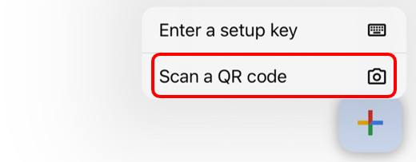

# 사용자 인증 및 권한 관리

현대의 모든 시스템은 **사용자 인증(Authentication)** 을 통해 누가 접근하는지 확인하고,
**권한 관리(Authorization)** 를 통해 무엇을 할 수 있는지를 제한합니다.

하지만 단순한 아이디/비밀번호 기반 인증만으로는 충분하지 않습니다.
비밀번호 유출, 피싱, 자동화 공격 등에 대비하기 위해, 더 강력한 인증 수단이 필수적입니다.

## 2FA (Two-Factor Authentication)

**2FA (Two-Factor Authentication)** 는 사용자 인증을 **두 가지 독립된 요소로 검증**하는 방식입니다.
인증방식에 따른 인증 방법 예시는 다음과 같습니다. 


| 인증 방식 | 예시 |
|-----------|------|
| Something you know | 비밀번호 |
| Something you have | 스마트폰 OTP 앱 |
| Something you are | 지문, 얼굴 등 생체 정보 |

**단순 비밀번호만 사용하는 시스템은 유출 시 매우 취약 합니다.** 이를 보완하기위해 2FA를 활용하는것이 하나의 보안 방안이 될 수 있습니다. 만약 공격자가 비밀번호를 알고 있는 상황이라 하여도 2차 인증 없이는 접근 불가능하기 때문입니다. 

## TOTP (Time-based One-Time Password)

**TOTP (Time-based One-Time Password)** 는 시간 기반으로 매번 바뀌는 6자리 숫자입니다. TOTP 에 특징은 다음과 같습니다. 

- **RFC 6238** 표준 기반
- 일반적으로 30초 주기로 새로운 OTP 생성
- Google Authenticator, Microsoft Authenticator, Authy 등에서 사용

## PyOTP

[`pyotp`](https://pypi.org/project/pyotp/)는 Python에서 **TOTP, HOTP**를 생성하고 검증할 수 있게 도와주는 라이브러리입니다. 설치 명령은 다음 명령을 활용합니다. 

```sh
pip install pyotp
```

PyOTP 의 주요 함수는 다음과 같습니다. 

| 함수 | 설명 |
|-----------|------|
| pyotp.random_base32() | 사용자 고유 비밀 키 생성 |
| pyotp.TOTP(secret) | TOTP 객체 생성 |
| totp.now() | 현재 OTP 코드 반환 |
| totp.verify(code) | 코드 유효성 검증 |

스마트폰의 OTP 앱에 등록할때 발행된 코드를 통해 입력하는것도 좋지만 QR Code를 활용하면 쉽게 등록이 가능하며 이를 활용하는것이 일반적입니다. 파이썬에서 QR Code 를 생성하는 라이브러리 설치는 다음과 같이 설치할 수 있습니다. 

```sh 
pip install qrcode[pil]
```

## 첫번째 OTP 인증 
otp 인증을 위한 절차는 다음과 같습니다. 

- OTP 앱 등록을 위한 사용자 고유 비밀 키 생성
- 사용자 고유 비밀 키 기반으로 OTP 코드 생성  
- QR Code 생성 (생략 가능)
- OTP 앱에서 비밀키 혹은 QR Code를 이용한 연동 
- 생성된 OTP 를 프로그램에 입력 

pyotp와 qrcode 를 활용하여 단순 otp 인증 프로그램을 작성하면 다음과 같이 작성할 수 있습니다. 

```python
import pyotp
import qrcode

secret = pyotp.random_base32()
print("Secret:", secret)

totp = pyotp.TOTP(secret)
uri = totp.provisioning_uri(name="user@example.com", issuer_name="SecureApp")

img = qrcode.make(uri)
img.save("otp_qr.png")

user_input = input("Input OTP Code: ")
if totp.verify(user_input):
    print("Authentication Success")
else:
    print("Authentication failed")
```

작성된 프로그램을 실행하면 생성된 비밀키가 화면에 출력되며 OTP 를 입력을 요구합니다. 이때 실행한 폴더를 확인하면 **"otp_qr.png"** 파일이 생성되어 있습니다. 이 파일은 OTP 앱에서 등록하는데 활용합니다. 

OTP 앱은 Google 에서 제공하는 Authenticator 를 활용합니다. Authenticator 는 App Store에서 무료로 받아 활용 가능합니다. 


앱을 설치하고 처음실행하면 Google 계정을 통한 로그인을 요구합니다. 본인의 Google 계정을 통한 로그인을 완료하면 우측 하단 "+" 메뉴 를 통해 OTP 인증을 추가할 수 있습니다. 



이제 생성된 otp_qr.png 파일을 열고 스마트폰을 활용해 촬영하면 등록이 완료되며 다음그림과 같이 OTP가 생성되고 일정 시간마다 코드의 값이 변경되는것을 볼 수 있습니다. 


생성된 OTP 를 화면에 입력하고 인증 절차를 진행하면 성공과 실패에 따른 결과를 확인할 수 있습니다. 


## OTP GUI 
비밀키와 같은 정보는 출력되어 다른 사람이 볼 수 있는 상황이 된다면 이미 비밀키로서의 기능은 상실된것과 마찬가지입니다. 이 정보를 출력하지 않고 생성된 QR Code를 GUI에서 출력하고 OTP를 입력받아 인증하는 형태로 프로그램을 작성해 봅니다. 

```python
import sys
import pyotp
import qrcode
from PySide6.QtWidgets import (
    QApplication, QWidget, QLabel, QPushButton, QLineEdit, QVBoxLayout, QMessageBox
)
from PySide6.QtGui import QPixmap
from PySide6.QtCore import Qt
import os

class OTPWindow(QWidget):
    def __init__(self):
        super().__init__()
        self.setWindowTitle("2FA")
        self.setFixedSize(300, 400)
        self.secret = pyotp.random_base32()
        self.totp = pyotp.TOTP(self.secret)

        self.init_ui()

    def init_ui(self):
        layout = QVBoxLayout()

        self.label_info = QLabel("1. SCAN QR Code\n2. Input OTP Code")
        self.label_info.setAlignment(Qt.AlignCenter)
        layout.addWidget(self.label_info)
        uri = self.totp.provisioning_uri(name="user@example.com", issuer_name="PySideApp")
        qr_path = "otp_qr.png"
        qrcode.make(uri).save(qr_path)

        self.qr_label = QLabel()
        self.qr_label.setPixmap(QPixmap(qr_path).scaled(200, 200, Qt.KeepAspectRatio))
        self.qr_label.setAlignment(Qt.AlignCenter)
        layout.addWidget(self.qr_label)

        self.input_otp = QLineEdit()
        self.input_otp.setPlaceholderText("Input OTP Code")
        self.input_otp.setMaxLength(6)
        self.input_otp.setAlignment(Qt.AlignCenter)
        layout.addWidget(self.input_otp)

        self.btn_verify = QPushButton("Verify authentication")
        self.btn_verify.clicked.connect(self.verify_otp)
        layout.addWidget(self.btn_verify)

        self.setLayout(layout)

    def verify_otp(self):
        otp_input = self.input_otp.text()
        if self.totp.verify(otp_input):
            QMessageBox.information(self, "Success", "Authentication Success")
        else:
            QMessageBox.warning(self, "Failed", "Authentication failed")

    def closeEvent(self, event):
        if os.path.exists("otp_qr.png"):
            os.remove("otp_qr.png")

if __name__ == "__main__":
    app = QApplication(sys.argv)
    window = OTPWindow()
    window.show()
    sys.exit(app.exec())
```

<details>
<summary>[심화]2단계 인증</summary>

## OTP GUI Advanced
OTP GUI 를 더 강화 하여 사용자 ID 와 Password 입력을 구성하고 입력된 ID 와 Password 가 맞다면 OTP 인증을 진행하도록 하는 형태로 구성해보겠습니다. 이 프로그램은 동작 조건은 다음과 같습니다. 

- ID 와 Password 는 암호화 되어 user_db.json 파일로 저장 
    - ID 와 Password 는 프로그램 실행시 암호화 되어 저장 
    - ID 와 Password 는 코드상에 존재 
        - 별도의 사용자 등록 창은 구성하지 않음 
- 로그인 윈도우  
    - 사용자 ID 와 Password 입력 
    - 입력된 정보와 암호화된 정보가 일치하는지 확인 하여 일치하는 경우 OTP 윈도우를 출력       
- OTP 윈도우  
    - 생성된 비밀키 기반으로 QR Code 생성 및 출력 
    - OTP 입력 후 인증 정보 확인 

```python
import sys
import os
import json
import pyotp
import qrcode
import base64
import hashlib
from cryptography.hazmat.primitives.kdf.pbkdf2 import PBKDF2HMAC
from cryptography.hazmat.backends import default_backend
from PySide6.QtWidgets import (
    QApplication, QWidget, QLabel, QPushButton, QLineEdit, QVBoxLayout, QMessageBox
)
from PySide6.QtGui import QPixmap
from PySide6.QtCore import Qt

USER_DB = "user_db.json"

def hash_password(password: str, salt: bytes) -> bytes:
    kdf = PBKDF2HMAC(
        algorithm=hashlib.sha256(),
        length=32,
        salt=salt,
        iterations=100000,
        backend=default_backend()
    )
    return kdf.derive(password.encode())

def load_users():
    if os.path.exists(USER_DB):
        with open(USER_DB, "r") as f:
            return json.load(f)
    return {}

def save_users(users):
    with open(USER_DB, "w") as f:
        json.dump(users, f)

def create_default_user():
    if not os.path.exists(USER_DB):
        salt = os.urandom(16)
        hashed = hash_password("password123", salt)
        users = {
            "admin": {
                "salt": base64.b64encode(salt).decode(),
                "password": base64.b64encode(hashed).decode()
            }
        }
        save_users(users)

class LoginWindow(QWidget):
    def __init__(self):
        super().__init__()
        self.setWindowTitle("Login")
        self.setFixedSize(250, 150)
        self.init_ui()

    def init_ui(self):
        layout = QVBoxLayout()
        self.user_input = QLineEdit()
        self.user_input.setPlaceholderText("Username")
        layout.addWidget(self.user_input)

        self.pw_input = QLineEdit()
        self.pw_input.setPlaceholderText("Password")
        self.pw_input.setEchoMode(QLineEdit.Password)
        layout.addWidget(self.pw_input)

        login_btn = QPushButton("Login")
        login_btn.clicked.connect(self.check_login)
        layout.addWidget(login_btn)

        self.setLayout(layout)

    def check_login(self):
        username = self.user_input.text()
        password = self.pw_input.text()
        users = load_users()
        if username in users:
            salt = base64.b64decode(users[username]["salt"])
            try:
                hashed = hash_password(password, salt)
                if base64.b64encode(hashed).decode() == users[username]["password"]:
                    self.accepted()
                    return
            except Exception:
                pass
        QMessageBox.warning(self, "Login Failed", "Invalid credentials")

    def accepted(self):
        self.close()
        self.otp_window = OTPWindow()
        self.otp_window.show()

class OTPWindow(QWidget):
    def __init__(self):
        super().__init__()
        self.setWindowTitle("2FA")
        self.setFixedSize(300, 400)
        self.secret_file = "otp_secret.txt"
        self.secret = self.load_or_create_secret()
        self.totp = pyotp.TOTP(self.secret)
        self.init_ui()

    def load_or_create_secret(self):
        if os.path.exists(self.secret_file):
            with open(self.secret_file, "r") as f:
                return f.read().strip()
        else:
            secret = pyotp.random_base32()
            with open(self.secret_file, "w") as f:
                f.write(secret)
            return secret

    def init_ui(self):
        layout = QVBoxLayout()
        self.label_info = QLabel("1. SCAN QR Code\n2. Input OTP Code")
        self.label_info.setAlignment(Qt.AlignCenter)
        layout.addWidget(self.label_info)

        uri = self.totp.provisioning_uri(name="admin@example.com", issuer_name="SecureApp")
        qr_path = "otp_qr.png"
        qrcode.make(uri).save(qr_path)

        self.qr_label = QLabel()
        self.qr_label.setPixmap(QPixmap(qr_path).scaled(200, 200, Qt.KeepAspectRatio))
        self.qr_label.setAlignment(Qt.AlignCenter)
        layout.addWidget(self.qr_label)

        self.input_otp = QLineEdit()
        self.input_otp.setPlaceholderText("Input OTP Code")
        self.input_otp.setMaxLength(6)
        self.input_otp.setAlignment(Qt.AlignCenter)
        layout.addWidget(self.input_otp)

        self.btn_verify = QPushButton("Verify authentication")
        self.btn_verify.clicked.connect(self.verify_otp)
        layout.addWidget(self.btn_verify)

        self.setLayout(layout)

    def verify_otp(self):
        otp_input = self.input_otp.text()
        if self.totp.verify(otp_input):
            QMessageBox.information(self, "Success", "Authentication Success")
        else:
            QMessageBox.warning(self, "Failed", "Authentication failed")

    def closeEvent(self, event):
        if os.path.exists("otp_qr.png"):
            os.remove("otp_qr.png")

if __name__ == "__main__":
    create_default_user()
    app = QApplication(sys.argv)
    login = LoginWindow()
    login.show()
    sys.exit(app.exec())
```
</details>

## 보안이 강화된 나만의 XHome Controller 
이번에는 '3-4 실시간 모니터링 시스템 구현' 에서 제작한 XHome Controller 의 기능을 강화 해보도록 하겠습니다. 
기존 프로그램은 사용자 인증, 그리고 OTP 와 같은 기능을 활용하고 있지 않으며 프로그램을 실행하면 연결되어 있는 장치를 바로 제어하는 형태였습니다. 
앞서 제작한 OTP 인증을 통해 본인의 스마트폰으로 인증 절차를 거치고 인증된 사용자만 XHome을 제어할 수 있는 GUI를 제어하도록 구성합니다. 동작 구조는 다음과 같습니다. 

- OTP 를 통한 사용자 인증 
    - 비밀키 생성은 최초 프로그램 실행시 생성 되어 파일로 저장 
    - 비밀키 기반으로 QR Code 생성 및 화면 출력 
    - QR Code 가 이미 생성되어 있다면 추가 생성 없이 이전 내용을 활용 
    - OTP 인증이 완료되면 XHome Controller 윈도우를 출력하여 제어 

GUI 코드는 앞서 작성한 XHome Controller 를 기반으로 합니다. XHome Controller 에서 수정되는 내용은 다음과 같습니다. 

```python
import sys
import os
import pyotp
import qrcode
from PySide6.QtWidgets import (
    QApplication, QMainWindow, QDialog, QLabel, QPushButton, QLineEdit,
    QVBoxLayout, QMessageBox
)
from PySide6.QtGui import QPixmap
from PySide6.QtCore import Qt, QTimer
from Remote import Ui_MainWindow
from xhome.sensors import Pir, Reed, Light, Tphg, Dust
from xhome.actuator import Lamp, DoorLock

class AuthDialog(QDialog):
    def __init__(self, secret_file="otp_secret.txt"):
        super().__init__()
        self.setWindowTitle("2단계 인증 (OTP)")
        self.secret_file = secret_file
        self.secret = self.load_or_create_secret()
        self.totp = pyotp.TOTP(self.secret)
        self.setFixedSize(300, 350)
        self.init_ui()

    def load_or_create_secret(self):
        if os.path.exists(self.secret_file):
            with open(self.secret_file, "r") as f:
                return f.read().strip()
        else:
            secret = pyotp.random_base32()
            with open(self.secret_file, "w") as f:
                f.write(secret)
            return secret

    def init_ui(self):
        layout = QVBoxLayout()
        label = QLabel("OTP 앱 등록 후\n6자리 코드를 입력하세요")
        layout.addWidget(label)

        if not os.path.exists("otp.png"):
            uri = self.totp.provisioning_uri(name="admin@xhome", issuer_name="MyHome")
            qrcode.make(uri).save("otp.png")

        qr_label = QLabel()
        qr_label.setPixmap(QPixmap("otp.png").scaled(200, 200, Qt.KeepAspectRatio))
        qr_label.setAlignment(Qt.AlignCenter)
        layout.addWidget(qr_label)

        self.otp_input = QLineEdit()
        self.otp_input.setPlaceholderText("6자리 OTP 입력")
        self.otp_input.setAlignment(Qt.AlignCenter)
        layout.addWidget(self.otp_input)

        btn = QPushButton("인증 확인")
        btn.clicked.connect(self.verify)
        layout.addWidget(btn)

        self.setLayout(layout)

    def verify(self):
        otp = self.otp_input.text().strip()
        if self.totp.verify(otp):
            self.accept()
        else:
            QMessageBox.warning(self, "인증 실패", "OTP 코드가 유효하지 않습니다.")

class Window(QMainWindow):
    def __init__(self):
        super().__init__()

--------------------- 중략 --------------------- 

if __name__ == "__main__":
    app = QApplication(sys.argv)

    auth_dialog = AuthDialog("otp_secret.txt")
    if auth_dialog.exec() == QDialog.Accepted:
        window = Window()
        window.show()
        sys.exit(app.exec())
    else:
        print("인증 실패: 프로그램 종료")
        sys.exit()
```

<details>
<summary>연습문제</summary>

## 연습문제 
XHome Controller 의 보안기능을 다음 조건을 만족하도록 수정해 보세요. 

- 로그인 윈도우 
    - 사용자 ID 와 Password 는 암호화 되어 저장되어 있으며 로그인 창에서 확인 절차 
    - 저장된 사용자 ID 와 Password 가 없다면 새로 등록할것인지 여부를 묻고 저장 기능 제공 
    - 사용자는 최대 1명으로 제한되며 인증된 사용자는 OTP 윈도우로 전환 
- OTP 윈도우 
    - 비밀키는 최초 1회 생성되며, 암호화 되어 저장 
    - QR Code 출력은 버튼을 통해 출력되며, 이때 Password 를 재확인 후 출력 
    - OTP 인증 절차가 완료되면 XHome Controller 윈도우 출력 
- XHome Controller 윈도우 
    - 센서 데이터 출력 
        - Pir, Reed, Light, Temperature, Humidity, Dust
    - 액츄에이터 제어 
        - Lamp, DoorLock 
</details>