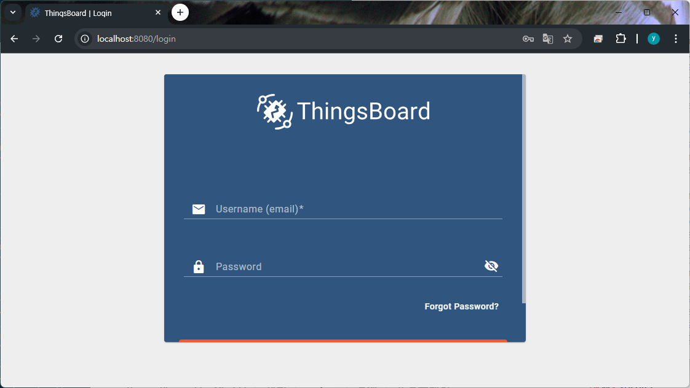
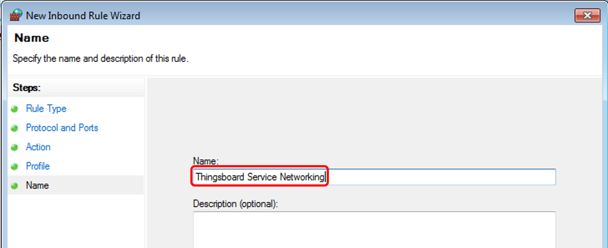

# 오픈소스 기반 IoT 클라우드 설치  
현대 산업과 일상생활에서 IoT 는 단순한 기술적 유행을 넘어서 스마트 팩토리, 홈 오토메이션, 헬스케어, 에너지 관리 등 다양한 분야에서 핵심 인프라로 자리 잡고 있습니다.

하지만 IoT 시스템의 구축은 단순히 센서를 연결하는 데 그치지 않고, 장치 데이터의 수집, 저장, 처리, 시각화, 제어 등을 위한 복잡한 백엔드 시스템이 요구됩니다. 이러한 과정을 효율적이고 경제적으로 수행하기 위한 해결책 중 하나가 바로 오픈소스 기반 IoT 클라우드 플랫폼입니다.

특히, 오픈소스 플랫폼은 다음과 같은 이점을 제공합니다:

- 비용 절감 : 상용 솔루션 대비 라이선스 비용 없이 사용 가능
- 유연성 : 커스터마이징 및 확장이 자유로움
- 투명성 : 코드가 공개되어 보안성과 신뢰성 검증 가능
- 커뮤니티 중심 : 전 세계 개발자들과의 협업 가능

## Thingsboard
Thingsboard는 Java 기반의 오픈소스 IoT 플랫폼입니다. 다양한 OS 를 지원하며 MQTT 및 CoAP, HTTP 를 통해 장치 연결을 지원하고 클라우드 및 온프레미스 배포를 모두 지원하는 플랫폼입니다. 주요 특징을 정리하면 다음과 같습니다. 

- 장치 관리 
- 실시간 데이터 수집 
- 대시보드 기반 시각화 
- Rule Engine 을 통한 이벤트 기반 처리 
- MQTT, HTTP, CoAP, WebSocket 등 다양한 프로토콜 지원 

Thingsboard 를 로컬 데스크탑에 설치하여 나만의 IoT 대시보드 프로젝트를 구축해 보겠습니다. 

## Thingsboard 설치 
Thingsboard 를 로컬에 설치하는 방법은 OS 별로 차이가 있습니다. 여기서는 Windows 에 설치하는 방법에 대해 소개 합니다. 

## Windows에 Thingsboard 설치 
Windows 에 Thingsboard 를 설치하여 활용하는 방법입니다. Windows 는 10/11 버전 기준이며, 최소 4GB 의 RAM이 필요합니다. 

### Java(OpenJDK) 설치 
Thingsboard 서비스는 Java 17 에서 실행됩니다. OpenJDK 17 을 다운로드 받아 설치를 진행합니다. 
- [JDK 17 Download Link](https://adoptium.net/temurin/releases/?os=any&arch=any&version=17)

설치 진행시 "PATH에 추가" 및 "JAVA_HOME 변수 설정" 옵션이 "로컬 하드 드라이브에 설치됨"으로 설정되어 있는지 확인해야 합니다. 


설치가 정상적으로 이루어졌다면 명령 프롬프트에서 다음 명령을 통해 설치를 확인할 수 있습니다. 

```sh
java --version 
```

### Thingsboard 서비스 설치 
Thingsboard 서비스는 다음 링크에서 다운로드 받을 수 있습니다. 
- [Thingsboard 4.0.1 Download](https://github.com/thingsboard/thingsboard/releases/download/v4.0.1/thingsboard-windows-4.0.1.zip)

다운로드가 완료되면 "C:\Program Files(x86)" 에 압축을 해제 합니다. 


### 데이터베이스 구성 
Thingsboard 는 PostgreSQL를 데이터베이스로 활용합니다. PostgreSQL 설치파일은 아래 링크를 통해 다운로드 받을 수 있습니다. 15버전 이상이 지원됨으로 15버전 이상을 선택하여 다운로드를 진행합니다. 

- [PostgreSQL Download Link](https://www.enterprisedb.com/downloads/postgres-postgresql-downloads#windows)

설치 과정에서 슈퍼유저(postgres)의 비밀번호 입력 메시지가 출력됩니다. 원하는 비밀번호를 선택하여 활용하시면 됩니다. 

PostgreSQL 설치가 완료되면 pgAdmin 을 실행합니다. 그리고 슈퍼유저로 로그인을 진행합니다. 


"thingsboard" 데이터베이스를 생성하고 소유자는 "postgres"로 설정합니다. 


### Thingsboard 설정 
설치한 데이터베이스를 연동하기 위해 설정파일을 수정합니다. **만약 슈퍼유저의 비밀번호를 "postgres" 로 지정했다면 아래 설정을 진행하지 않아도 관계 없습니다.** 

설정파일은 다음 경로에 있습니다. 
```sh
C:\Program Files (x86)\thingsboard\conf\thingsboard.yml
```

설정 파일에는 미리 설정되어 있는 내용들이 있습니다. 여기서 "SQL DAO" 를 검색하고 하위 설정 중 "password" 에 자신이 설정한 비밀번호를 입력합니다. 

```conf 
# SQL DAO Configuration parameters
spring:
  data:
    jpa:
      repositories:
        enabled: "true"
  jpa:
    properties:
      jakarta.persistence.query.timeout: "${JAVAX_PERSISTENCE_QUERY_TIMEOUT:30000}"
    open-in-view: "false"
    hibernate:
      ddl-auto: "none"
  datasource:
    driverClassName: "${SPRING_DRIVER_CLASS_NAME:org.postgresql.Driver}"
    url: "${SPRING_DATASOURCE_URL:jdbc:postgresql://localhost:5432/thingsboard}"
    username: "${SPRING_DATASOURCE_USERNAME:postgres}"
    password: "${SPRING_DATASOURCE_PASSWORD:postgres}"
```

### 설치 스크립트 실행 
이제 Thingsboard 설치를 진행합니다. 명령 프롬프트를 관리자 권한으로 실행하고 다음 명령을 입력합니다. 
```sh
cd "Program Files (x86)"\thingsboard
.\install.bat --loadDemo
```


 
### Thingsboard 서비스 시작 
이제 Thingsboard 서비스를 시작합니다. 관리자 권한으로 실행된 명령 프롬프트에서 다음 명령을 통해 서비스를 시작할 수 있습니다. 

```sh 
net start thingsboard 
```

이미 실행중인 서비스를 재시작 하고 싶은 경우에는 다음 명령을 활용합니다. 

```sh
net stop thingsboard 
net start thingsboard  
```

서비스가 실행되어 있는 상태에서 Chrome 등의 웹브라우저를 열고 주소창에 다음과 같이 입력하면 Thingsboard 로그인 화면을 볼 수 있습니다. 

- http://localhost:8080

 

기본적으로 설정되어 있는 유저는 3가지가 있습니다. 설정되어 있는 유저는 다음과 같습니다. 

| ID | Password | Profile |
|:-------|:------|:------|
| sysadmin@thingsboard.org | sysadmin | System Administrator |
| tenant@thingsboard.org | tenant | Tenant Administrator |
| customer@thingsboard.org | customer | Customer User |

이중 tenant@thingsboard 를 활용하여 로그인합니다. 


## 주의 사항 

### 방화벽 문제 
ThingsBoard는 다양한 통신 프로토콜(MQTT, HTTP 등)을 기반으로 작동하기 때문에, 운영 체제의 방화벽 설정에 따라 서비스가 정상적으로 동작하지 않을 수 있습니다. 특히, 웹 인터페이스에 접속되지 않거나 장치 데이터가 수신되지 않는 문제가 발생할 수 있습니다. 접속에 장애가 있는경우 아래 절차에 따라 방화벽설정을 진행합니다. 

Windows의 설정에서 "Windows 방화벽" 을 엽니다. 


왼쪽 메뉴에서 "고급 설정" 을 선택합니다. 


방화벽 설정에서 왼쪽 메뉴중 "인바운드 규칙"을 선택하고 우측에서 "새 규칙" 을 선택합니다. 


새로운 인바운드 규칙에서 첫번째는 "포트" 를 선택하고 이후 "TCP" 그리고 특정 포트를 추가합니다. 추가할 포트는 8080, 1883, 5683 입니다. 


이제 작업에서 "연결 허용" 으로 설정합니다. 그리고 프로필은 상황에 따라 설정하면 됩니다. 여기서는 모두 허용할 수 있도록 합니다. 


마지막으로 규칙의 이름을 지정합니다. 



### MQTT Broker 문제 
Thingsboard 서비스는 MQTT에서 활용하는 1883 포트를 활용합니다. 따라서 설치한 로컬 환경에서 Thingsboard 이외에 MQTT 브로커가 동작중인 상황이라면 Thingsboard 서비스가 정상적으로 실행되지 않을 수 있습니다. Thingsboard 서비스를 정상적으로 활용하고 싶다면 실행중인 MQTT 브로커를 모두 종료하고 서비스를 다시 실행하기 바랍니다. 

### 로그 
Thingsboard 서비스는 서비스 실행 시점 부터 동작중인 상태의 로그를 확인할 수 있습니다. 이 로그를 통해 서비스에 장애 혹은 데이터 송수신 상태 등의 정보들을 확인할 수 있습니다. 로그파일의 위치는 다음과 같습니다. 

- C:\Program Files(x86)\thingsboard\logs\thingsboard.log