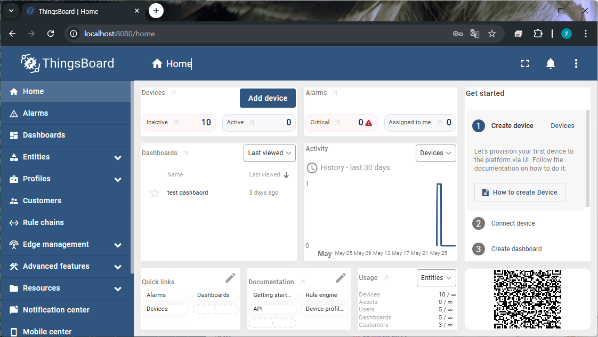
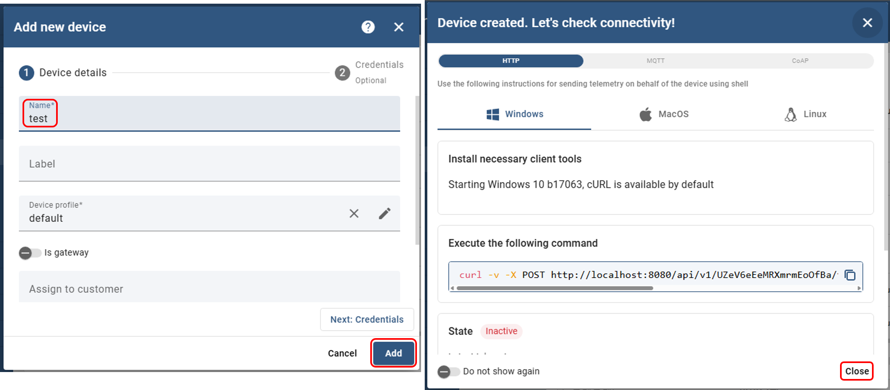
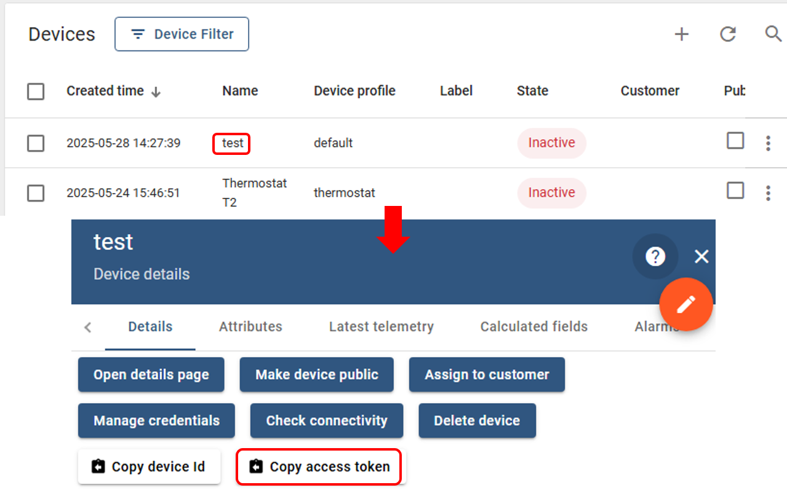
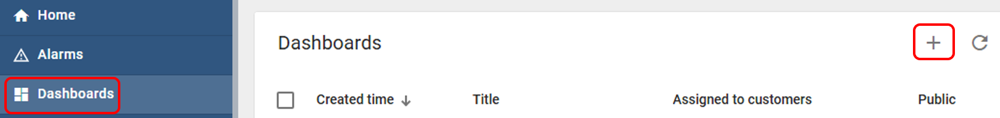
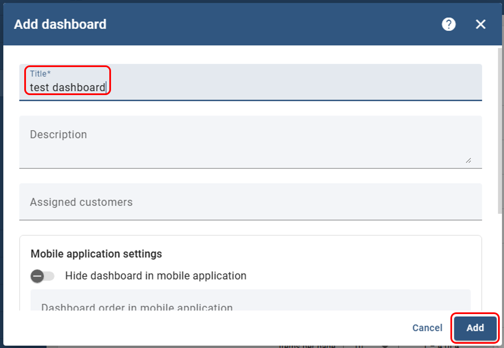
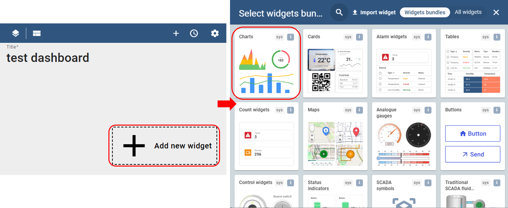
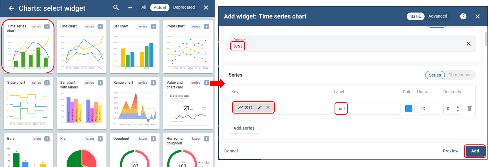
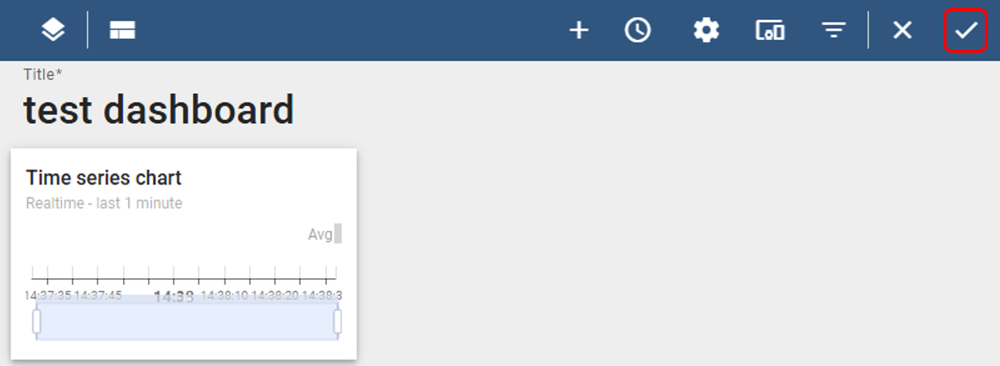
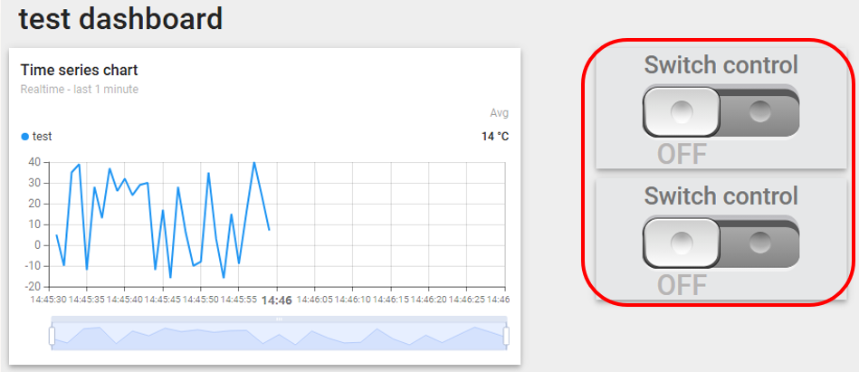
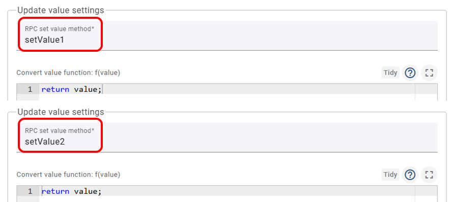

# 오픈소스 기반 IoT 클라우드 활용  
로컬에 설치한 Thingsboard 서비스를 활용해 보도록 하겠습니다. 우선 tenant 유저로 로그인합니다.



처음 페이지에서는 다양한 정보를 확인할 수 있습니다. 등록되어 있는 장치의 목록, 대시보드, 알람 로그, 활동 기록등의 정보를 확인할 수 있습니다. 

## Thingsboard 첫 활용 
### 장치 등록 

가장 간단한 통신을 위한 설정을 진행해보겠습니다. 우선 장치 추가 버튼을 누릅니다. 


장치 추가 화면에서는 이름을 지정합니다. 이름은 원하는 대로 지정하고 다른 설정은 진행하지 않습니다. 만약 커스터머 유저에게 장치할당이 필요하다면 지정합니다. 등록이 완료되면 간단한 명령을 통해 테스트 할 수 있는 명령이 출력됩니다. 이를 통해 동작 테스트를 진행할 수 있습니다. 



장치 생성이 완료되면 장치에 접근하기위한 토큰 복사를 위해 생성한 장치의 명칭을 클릭합니다. 출력되는 화면에서 장치의 속성 등의 여러 정보를 확인할수도있고 장치의 아이디나 토큰을 복사하는 작업을 진행할 수 있습니다. 여기서 토큰은 이후 작성하는 프로그램에서 활용합니다. 



이제 장치에서 수신한 데이터를 표기하거나 위젯을 활용하여 장치로 데이터를 송신하기 위한 대시보드를 구성합니다. 

### 대시 보드 구성 



대시 보드 설정은 별다른 설정을 진행하지 않고 명칭을 원하는대로 구성하고 하단 추가버튼을 눌러 설정을 마무리 합니다. 



이제 대시보드에 위젯을 추가합니다. 기본적으로 제공되는 위젯도 활용 가능하고 JSON 형태로 구성된 위젯을 사용자가 임의로 생성하여 활용도 가능합니다. Charts 를 통해 수신된 데이터를 출력하도록 해보겠습니다. 



차트의 종류 중 "Time series chart" 를 활용해 보겠습니다. Datasource 는 등록되어 있는 장치중 어떠한 장치를 통해 데이터를 수신하여 위젯에 출력할것인지 선택하며 Series의 Key는 장치에서 데이터를 송신할 때 활용됩니다. 



설정한 위젯을 저장합니다. 저장하지 않으면 앞서 설정한 위젯의 정보는 반영되지 않습니다. 



### 난수 송신 프로그램 
이제 설정한 장치와 대시보드에 데이터를 전송하는 프로그램을 작성해보도록 하겠습니다. MQTT 를 통해 데이터를 전송하는 프로그램입니다. 브로커는 Thingsboard 서비스를 설치하며 함께 동작하기 때문에 로컬망을 활용합니다. 만약 Thingsboard 서비스가 로컬이 아닌 다른 위치라면 IP 혹은 도메인을 정확하게 입력합니다. 

Thingsboard 에 MQTT 로 데이터를 송신할 때는 "v1/devices/me/telemetry" 토픽에 JSON 형태의 데이터를 전송합니다. JSON 형태에서 Key는 위젯 설정에서 활용한 Key 입니다. value 는 위젯에 전송할 데이터를 전달하면 됩니다. 

```python
import paho.mqtt.client as mqtt
import time, json, random

BROKER_DOMAIN = "localhost"
TOKEN = "your-token"
TELEMETRY_TOPIC = "v1/devices/me/telemetry"

client = mqtt.Client()
client.username_pw_set(TOKEN)
def main():
    client.connect(BROKER_DOMAIN,port=1883)
    client.loop_start()
    number = 0
    while True:
        number = random.randint(-20,40)
        payload = json.dumps({"test": number})
        client.publish(TELEMETRY_TOPIC, payload)
        time.sleep(1)

if __name__ == "__main__":
    main()
```

작성한 프로그램을 실행하면 1초마다 대시보드에 설정한 위젯에 차트가 업데이트되는 것을 확인할 수 있습니다. 


### 제어 위젯 활용 
제어 위젯에 Switch 위젯을 2개 추가하여 활용해 보겠습니다. 



위젯의 장치 설정은 차트와 동일하게 설정합니다. "Appearance" 에 설정을 변경하는데 Value settings 에서 Update Value settings 를 변경합니다. 
"RPC set value method" 가 기본 설정은 두개의 위젯이 동일합니다. 이를 변경하여 위젯마다 동작을 구분할 수 있도록 합니다. 



설정이 완료되면 대시보드 설정을 저장합니다. 

이제 제어된 스위치 위젯의 데이터를 수신하는 프로그램을 작성해보겠습니다. 제어 위젯의 상태를 수신하기 위해 구독할 토픽은 "v1/devices/me/rpc/request/+" 입니다. 

```python
import paho.mqtt.client as mqtt
import time, json, random

BROKER_DOMAIN = "localhost"
TOKEN = "your-token"
TELEMETRY_TOPIC = "v1/devices/me/telemetry"
REQUEST_TOPIC_HEADER = "v1/devices/me/rpc/request/+"

def on_message(client, userdata, msg):
    print('Recieved:', msg.topic, msg.payload.decode())

def on_connect(client, userdata, flags, rc):
    client.subscribe(REQUEST_TOPIC_HEADER)

client = mqtt.Client()
client.username_pw_set(TOKEN)
def main():
    client.on_message = on_message
    client.on_connect = on_connect
    client.connect(BROKER_DOMAIN,port=1883)
    client.loop_start()
    number = 0
    while True:
        number = random.randint(-20,40)
        payload = json.dumps({"test": number})
        client.publish(TELEMETRY_TOPIC, payload)
        time.sleep(1)

if __name__ == "__main__":
    main()
```

## XHome 연동 
XHome 의 TPHG 센서의 데이터 중 온도와 습도, 그리고 5개의 램프를 제어하는 대시보드를 구성합니다. 각 위젯의 설정은 다음과 같습니다. 

- Time Series Chart 
    - Datasource : test 
    - Series
        - Key : Temperature, Label : temperature, Units : °C
        - Key : Humidity, Label : humidity , Units : % 
- Entrance Lamp Switch 
    - Title : Entrance Lamp 
    - RPC set value method : entrance
- Livingroom Lamp Switch 
    - Title : Livingroom Lamp 
    - RPC set value method : livingroom
- Kitchen Lamp Switch 
    - Title : Kitchen Lamp 
    - RPC set value method : kitchen
- Room Lamp Switch 
    - Title : Room Lamp 
    - RPC set value method : room
- Bathroom Lamp Switch 
    - Title : Bathroom Lamp 
    - RPC set value method : bathroom

연동 예제 코드는 다음과 같습니다. 

```python
import paho.mqtt.client as mqtt
import time, json
from xhome.actuator import Lamp
from xhome.sensors import Tphg

BROKER_DOMAIN = "localhost"
TOKEN = "your-token"
TELEMETRY_TOPIC = "v1/devices/me/telemetry"
REQUEST_TOPIC_HEADER = "v1/devices/me/rpc/request/+"

lamp = Lamp()
tphg = Tphg()

def on_message(client, userdata, msg):
    global lamp
    recv_data = json.loads(msg.payload)
    if recv_data['params']:
        lamp.on(recv_data['method'])
    else:
        lamp.off(recv_data['method'])

def on_connect(client, userdata, flags, rc):
    client.subscribe(REQUEST_TOPIC_HEADER)

client = mqtt.Client()
client.username_pw_set(TOKEN)
def main():
    client.on_message = on_message
    client.on_connect = on_connect
    client.connect(BROKER_DOMAIN,port=1883)
    client.loop_start()
    while True:
        tphg_data = tphg.read()
        payload = json.dumps({"Temperature": tphg_data['temperature'],
                              "Humidity" : tphg_data['humidity']})
        client.publish(TELEMETRY_TOPIC, payload)
        time.sleep(1)

if __name__ == "__main__":
    main()
```