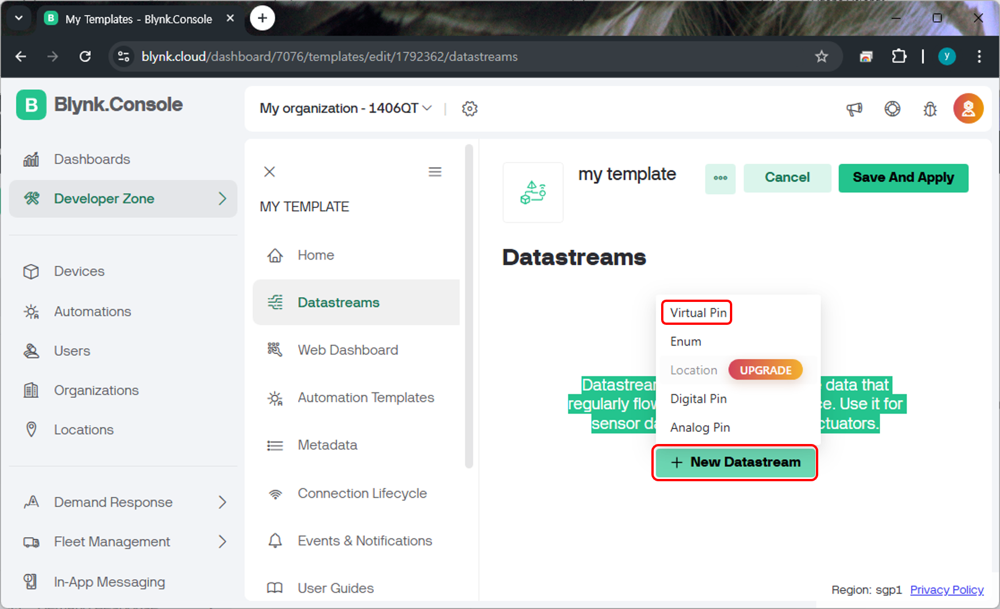

# IoT Dashbaord Service 
IoT Dashbaord Service는 사물 인터넷 시스템의 센서 데이터 시각화, 장치 제어, 상태 모니터링을 한눈에 할 수 있도록 제공되는 웹 또는 앱 기반의 시각화 도구입니다. 주요 기능을 정리하면 다음과 같습니다. 

- 데이터 시각화 
    - 센서 데이터(온도, 습도 등)를 실시간 그래프, 차트 등의 형태로 표시 
- 장치 상태 모니터링 
    - 연결 상태, 배터리 잔량, 신호 강도 등의 정보 표시 
- 장치 제어 
    - 조명 밝기 조절, 문 열림/닫힘 등의 사용자가 원격으로 IoT 장치를 제어 
- 알림 및 이벤트 로그 
    - 이상 발생 시 알림 표시 및 과거 이벤트 로그 확인 
- 사용자 인증 및 권한 
    - 로그인 기반 접근, 관리자/일반 사용자 권한 분리 
- 다중 디바이스 지원 
    - 여러개의 IoT 기기를 그룹으로 관리 

Dashboard Service 는 상용으로 제공되는 서비스가 존재하며, 서비스 제공자 따라 오픈소스 기반으로 소스코드를 공개하는 서비스도 존재 합니다. 대부분의 서비스는 기본 사용은 무료로 제공하며 일정 사용량 혹은 일정 장치의 수 까지는 무료이며 그 이상의 서비스 활용을 원하는 경우 과금 체계에 따라 과금을 지불함으로써 사용이 가능합니다. 

## Blynk 
Blynk는 상용 IoT 프레임워크로써 Bylnk Server 를 통해 타깃의 하드웨어를 웹 혹은 앱을 통해 원격으로 제어할 수 있습니다. 모바일 앱은 안드로이드와 아이폰을 동시 지원하며 네트워크가 연결되어 있다면 언제든지 스마트폰을 이용해 타깃을 제어할 수 있습니다. 


Blynk 에 대한 상세한 서비스 내용과 과금체계는 Bylnk 홈페이지를 통해 확인이 가능합니다. 
- [Blynk Home Page](https://blynk.io/)

## First Blynk Project 
Blynk 프로젝트 생성을 위해 Blynk Cloud에 접속하여 회원 가입을 진행합니다. 별도의 비용은 발생하지 않으며 E-Mail을 통한 인증 절차를 마무리 하면 회원 가입이 마무리 됩니다. Bylnk Cloud 페이지는 아래 링크를 통해 접속합니다. 
- [Blynk Cloud Page](https://blynk.cloud)


### Template 생성 
Blynk Template을 생성합니다. Device 생성시 하나씩 설정해도 되지만 미리 작성된 내용을 기반으로 장치를 등록할때 쉽게 설정하기 위함입니다. 


Template에 필요한 설정은 Template 명칭, 하드웨어, 연결방식 입니다. 명칭은 임의로 입력해도 관계 없으며 하드웨어는 XHome의 HMI인 Raspberry Pi를 그리고 연결 방식은 Wi-Fi를 선택합니다. 


### Devices 등록 

이제 생성한 Template를 활용하여 Device 를 등록합니다. 좌측 메뉴의 Devices를 누르면 아래와 같은 화면을 확인할 수 있습니다. 


"New Device" 를 선택하면 다음과 같은 팝업이 생성되며 여기서 "From Template" 를 선택하여 작성한 내용에서 장치를 선택하도록 합니다. 


이후 작성한 Template을 선택하고 장치의 이름을 지정합니다. 장치의 이름은 별도로 지정하지 않는다면 자동생성되지만 원하는 이름으로 변경하여 사용해도 관계없습니다. 


설정이 완료되면 새로운 장치가 등록되며 아래와 같은 페이지로 넘어 갑니다. 여기서 출력되는 내용중 "BLYNK_AUTH_TOKEN"은 이후 작성할 프로그램에서 인증키와 같은 역활을 담당합니다. 따라서 이 내용을 별도의 메모장과 같은곳에 복사하는것을 권장합니다. 만약 잊어 버린경우에는 Devices 페이지에서 다시 확인할 수 있습니다. 


### Datastream 설정  
이제 Datastreams을 생성합니다. Datastreams은 장치와 Blynk간에 어떠한 타입의 데이터를 주고받을것인지 정의하고 구조화 하는 방법입니다. 실제 장치의 핀을 제어하는 형태로 구성도 가능하고, 존재하지 않는 가상의 핀을 생성하는것도 가능합니다. Datastreams 를 생성하기 위해 Devices 페이지에서 Datastreams을 추가할 장치를 선택합니다. 


이후 나타나는 페이지에서는 Web Dashboard 를 설정할 수 있습니다. Dashboard 설정 이전에 먼저 Datastream을 생성하기위해 "Edit" 버튼을 눌러 설정페이지로 진입합니다. 


좌측 메뉴에서 Datastreams 를 선택하고 "New Datastream" 을 선택하면 아래와 같은 화면을 확인할 수 있습니다. 여기서는 정해진 하드웨어를 제어하는 형태가 아닌 단순 데이터를 주고 받기 위해 가상의 핀을 설정합니다. "Virtual Pin" 을 선택합니다.  



가상핀의 상세 설정을 진행합니다. 설정 내용은 다음과 같습니다. 
- Name : Integer V0
- PIN : V0 
- Data Type : Integer
- MIN : 0
- MAX : 0
- DEFAULT VALUE : 0 


설정을 완료하면 설정된 내용이 Datastreams 페이지에 표기됩니다. 이 떄 우측상단에 "Save And Apply"를 선택해야 작성된 내용이 저장되어 적용되면 누르지 않은채로 페이지를 이동하게 되면 다시 설정을 진행해야 합니다. 


여러개의 데이터를 주고 받는 상황을 구현하려면 Datastream의 설정을 원하는 숫자 만큼 별도로 진행하면 되며, 정수 형태의 데이터 이외에도 실수, 문자의 데이터도 설정하여 활용할 수 있습니다. 

### Dashboard 설정 
이번에는 Datastream을 통해 송/수신 되는 데이터를 제어하거나 확인할 수 있는 Dashboard 설정을 진행합니다. 좌측 메뉴에서 Devices를 선택하면 Web Dashbaord 설정할수있는 화면이 출력되며, 미리 설정한 위젯이 있다면 배치한 위젯이 출력됩니다. 위젯에 출력되는 정보는 장치가 동작중인 상태에서 갱신되기 때문에 장치에서 프로그램을 별도로 실행하지 않은 상태라면 위젯의 모양만 출력됩니다. 


Dashboard 편집화면으로 진입하면 좌측에 활용가능한 위젯의 종류가 나타나며, 우측에 대쉬보드에 원하는 위젯을 위치시켜 활용하는 형태입니다. 위젯은 무료로 활용가능한 위젯과 유로로 활용가능한 위젯으로 나뉘어 있습니다. 단순한 정수 데이터 표기 용도로 "Gauge" 위젯을 Dashbaord에 드래그하여 원하는 위치에 위치합니다. 크기도 원하는 형태로 변환합니다. 배치한 위젯에 마우스 커서를 가져가면, 우측 상단에 3개의 메뉴가 출력되며 이 메뉴는 위젯을 복사, 위젯의 세부 설정, 위젯 삭제 기능을 담당합니다. 

배치한 "Gauge" 위젯에 앞서 생성한 Datastream 을 연결하기 위해 설정 화면으로 진입합니다. 


TITLE의 내용은 원하는대로 작성해도 관계 없지만, Datastream은 미리 설정한 Datastream에서 선택할 수 있습니다. 별도로 생성한 내용이 없다면 앞의 내용을 참고하여 Datastream 설정을 진행합니다. 이렇게 설정하고 저장하게되면 Datastream 에 설정한 가상핀(V0)를 통해 데이터가 수신되면 위젯에 해당 정보가 표기됩니다. 저장후 Dashboard 설정을 저장하도록 우측 상단에 "Save And Apply" 를 선택하여 지금까지의 설정을 저장합니다. 


### 장치 프로그래밍 
Blynk는 Arduino 및 Python 등의 라이브러리를 제공하며 제공되는 라이브러리르 통해 쉽게 접근이 가능합니다. 최신 버전의 Blynk 라이브러리는 다음 링크에서 확인할수 있습니다. 
- [Blynk Library Link](https://github.com/blynkkk/blynk-library/releases)

장치에는 Blynk 라이브러리가 미리 설치되어 있으며 최신 업데이트나 특정 버전을 설치해야하는 경우라면 앞의 링크에서 관련 파일을 다운로드 받아 설치하면 됩니다. 

앞에서 설정한 Datastream 을 통해 데이터를 송신하여 Dashbaord에 갱신되는 코드를 작성하면 다음과 같이 작성할 수 있습니다. 여기서 'your-token' 부분은 Device 등록시 생성된 토큰 정보로 개개인마다 다른 데이터입니다. 관련 내용을 명확하게 수정하여 저장해야 내가 설정한 Dashboard에 데이터가 표기됩니다. 

```python
import BlynkLib
import time 
import random 

blynk = BlynkLib.Blynk('your-token')

while True:
    blynk.run()
    data = random.randint(0,100)
    blynk.virtual_write(0, data)
    time.sleep(1)
```

토큰 정보등을 작성하여 실행하면 1초마다 0~100 사이의 정수를 생성하여 Blynk Server로 전송합니다. 이때 virtual_write에 인자로 전달된 '0'은 앞서 설정한 Datastream의 가상핀 V0를 의미합니다. 1초마다 데이터를 송신하며 이때 Dashbaord를 확인하면 임의의 숫자가 지속적으로 갱신되는것을 확인할 수 있습니다. 이때 Dashboard를 수정하고 있는 상황에서는 데이터가 갱신되지 않습니다. 


## Dashbaord 제어를 통한 데이터 수신 
앞서 작성한 내용은 장치에서 Blynk로 데이터를 전송하는 방법에 대해 소개했습니다. 이번에는 반대로 Dashboard에서 위젯을 제어하여 데이터를 장치로 전송하여 수신한 데이터를 출력하는 형태로 구성해 보겠습니다. 우선 Datastream을 1개 새로 추가합니다. 


Dashboard에는 Slider 위젯을 추가합니다. 


이번에 전송할 데이터는 실수형태의 데이터 입니다. Slider는 기본적으로 좌우로 버튼을 눌러 지정한 크기만큼 숫자를 눌리거나 줄이는 용도로 활용할 수 있으며, 'O' 아이콘을 드래그하여 원한는 데이터로 표기도 가능합니다. 기본설정은 정수 1씩 이동하도록 설정되어 있습니다. 이를 0.1 로 변경하여 세부적으로 제어할 수 있도록 변경하고 저장합니다. 


이제 연동을 위한 프로그램을 작성합니다. 앞서 Blynk에 데이터를 송신하는 내용과는 다르게 수신된 데이터를 출력하는 형태의 코드입니다. 

```python
import BlynkLib

blynk = BlynkLib.Blynk('your-token')

@blynk.on("V1")
def my_recv_handler(value):
    print("Current V1 value: ",value[0])

while True:
    blynk.run()
```

수신되는 데이터를 처리하기위한 콜백 메소드를 등록합니다. 이때 데커레이터를 통해 V1의 데이터가 수신될때 my_recv_handler가 호출되도록 등록합니다. my_recv_handler의 인자인 value를 통해 데이터가 수신되며 이를 화면에 출력하는 코드입니다. 


## Mobile Dashboard 
Blynk는 Web Dashboard 이외에 Mobile Dashboard 기능도 제공합니다. Mobile에서는 Dashboard를 별도로 설정하여 Web과는 별도로 활용이 가능합니다. Android 와 IOS를 모두 지원하고 있으며 App Store에서 Blynk를 검색하면 무료로 다운로드 받아 사용이 가능합니다. 


Blynk IoT 라는 이름의 앱을 무료로 다운로드 받을수 있으며, 초기에 로그인 화면에서는 앞서 가입한 아이디를 기반으로 로그인을 시도합니다. 로그인이 완료되면 앞서 등록한 장치를 확인할 수 있습니다. 


장치를 누르면 Dashboard 화면으로 넘어갑니다. 이때 설정한 내용이 없음으로 별도의 위젯이 출력되지는 않습니다. 위젯추가를 위해 Dashboard 를 수정합니다. 우측 상단의 설정 버튼을 누르면 Dashboard 수정 화면으로 진입할 수 있습니다. 


Dashboard 수정화면에서 하단의 '+' 아이콘을 누르면 위젯을 추가할수 있는 창이 나타납니다. 


위젯은 Web Dashboard 사용과 마찬가지로 무료로 활용가능한 위젯이 있고 유료로 활용가능한 위젯이 있습니다. 이중 앞서 활용한 Gauge와 Slider를 선택하여 배치합니다. 


각각의 위젯에 Datastream 설정이 되어 있지 않은 상황으로 이상태에서는 전송한 데이터를 수신할수도 없고, 위젯 제어를 통해 데이터를 송신할수도 없습니다. Datastream 설정은 배치되어 있는 위젯은 한번 터치하면 설정 창으로 진입할 수 있습니다. 각각을 앞서 Web Dashboard와 동일하게 설정을 진행합니다. 


이제 연동 프로그램을 작성합니다. 앞서 두번의 프로그램은 Blynk로 데이터를 전송하거나 반대로 Blynk로 부터 데이터를 수신하는 한가지 역활로만 구성되어 있었습니다. 이번에는 두 기능을 동시에 구현합니다. Slider를 제어하여 수신된 데이터를 다시 전달하여 Gauge에 표기하도록 합니다. 단, Slider 제어에서 수신되는 데이터는 실수이고, Gauge에 표기되는 데이터는 정수입니다. 따라서 수신된 데이터를 그대로 전송하게되면 데이터 타입이 맞지 않아 동작이 정상적으로 되지 않습니다. 

```python
import BlynkLib
import time 

data = 0

blynk = BlynkLib.Blynk('your-token')

@blynk.on("V1")
def my_recv_handler(value):
    global data
    data = round(float(value[0]))

while True:
    blynk.run()
    blynk.virtual_write(0, data)
    time.sleep(1)
```

Slider를 제어하여 V1을 통해 수신된 데이터는 문자형태의 데이터입니다. 이를 실수로 변환하고, 소수점을 제거하여 정수형태로 변환합니다. 변환된 데이터를 V0에 전송하면 Guage에 표기가 가능합니다. 수신된 데이터를 V0로 전송하기 위해서 전역변수에 데이터를 저장합니다. 


